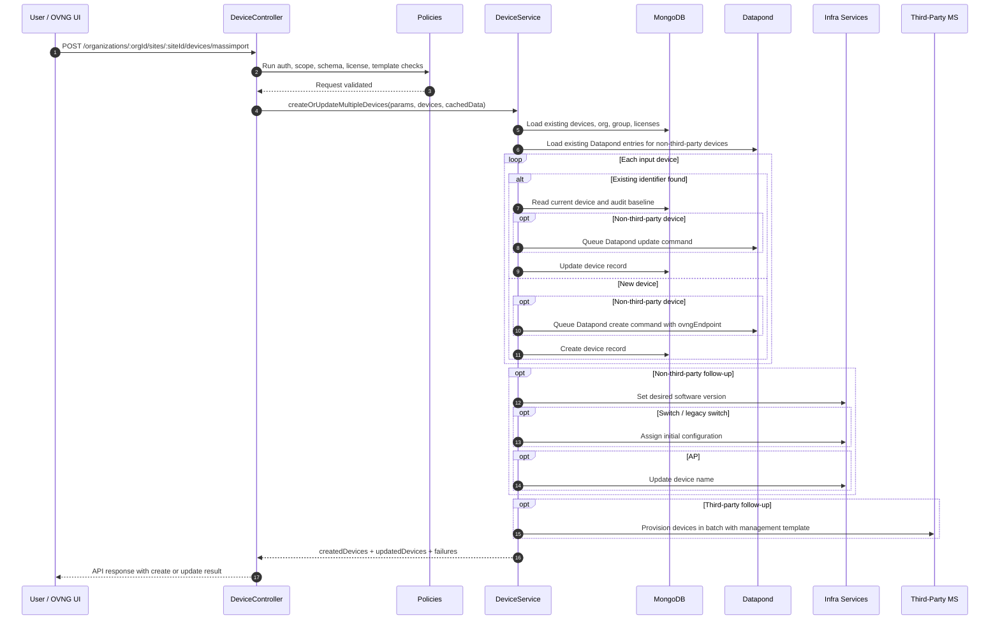
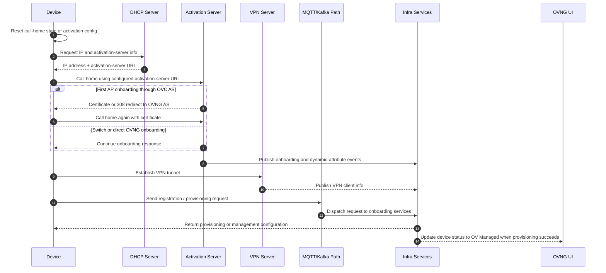

# Device Network Feature

## Overview

This document explains three related topics:

1. How the backend calculates `managementConnectivity` for a device.
2. How the OVNG backend mass-import create flow works.
3. How a device moves from CLI reset and call-home to `OV Managed` in the UI.

Important deployment note:

- In current deployments, the management-connectivity environment variables are not overridden.
- As a result, the backend uses the default values defined in [config/env/production.js](../../config/env/production.js).

---

## Management Connectivity Calculation

### Where The Value Is Calculated

`managementConnectivity` is not stored as a fixed field during device creation.

It is calculated when the backend enriches a device with dynamic attributes, mainly from:

- [api/services/DeviceService.js](../../api/services/DeviceService.js) in `calculateManagementConnectivityPerDevice(...)`
- [scripts/helpers/getManagementConnectivityStatus.js](../../scripts/helpers/getManagementConnectivityStatus.js)

The service applies the calculation after dynamic attributes are loaded, using `dynamicAttrs.lastHeartBeat` as the main timestamp.

### Effective Default Thresholds In Production

Because deployments currently do not override the related environment variables, these defaults from [config/env/production.js](../../config/env/production.js) are used:

| Device family | Unknown threshold | Off threshold | Comparison used |
|---|---:|---:|---|
| Regular devices (`AP`, `AOS`, most others) | `> 2` minutes | `> 3` minutes | strict `>` |
| `THIRD_PARTY` and `LEGACY_OMNISWITCH` | `> 8` minutes | `>= 12` minutes | inclusive `>=` for `OFF` |

The conversion factor and ping timeout also use defaults from [config/env/production.js](../../config/env/production.js):

- `networkConfigMicroService.receivingTime = 60`
- `networkConfigMicroService.pingTimeOut = 15`

In practice, `receivingTime = 60` means the backend converts seconds into minutes with:

```text
receivingTimeMinutes = (currentTime - lastHeartBeat) / 60
```

### Core Helper Logic

The helper in [scripts/helpers/getManagementConnectivityStatus.js](../../scripts/helpers/getManagementConnectivityStatus.js) works as follows:

1. Choose the threshold set.
2. If there is no `lastHeartBeat`, return an empty string.
3. Compute elapsed time since the last heartbeat in minutes.
4. Return:
   - `OFF` when the off threshold is reached.
   - `UNKNOWN` when only the unknown threshold is exceeded.
   - `ON` otherwise.

### DeviceService Special Rules

The wrapper logic in [api/services/DeviceService.js](../../api/services/DeviceService.js) adds important behavior before calling the helper.

#### 1. Registered devices with a heartbeat are forced to `OFF`

If:

- `dynamicAttrs.activationStatus === REGISTERED`
- and `dynamicAttrs.lastHeartBeat` exists

then the backend directly sets:

```text
managementConnectivity = OFF
```

This is a defensive rule added for the case where Infra moves a device back to `Registered` during license release.

#### 2. `pingTime` can force `OFF`

If `device.pingTime` exists and is newer than `lastHeartBeat`, the backend assumes a ping was sent after the last heartbeat.

Then:

- if `currentTime - pingTime < pingTimeOut` (`15` seconds by default), the backend still evaluates the heartbeat normally.
- if `currentTime - pingTime >= pingTimeOut`, the backend immediately returns `OFF`.

This means a recent unanswered ping can move the device to `OFF` faster than the heartbeat thresholds alone.

#### 3. No `pingTime` means pure heartbeat-based evaluation

If there is no usable `pingTime`, the backend falls back to the helper thresholds only.

### Result Matrix

#### Regular devices

| Elapsed since `lastHeartBeat` | Result |
|---|---|
| no heartbeat yet | empty string |
| `<= 2` minutes | `ON` |
| `> 2` and `<= 3` minutes | `UNKNOWN` |
| `> 3` minutes | `OFF` |

#### `THIRD_PARTY` and `LEGACY_OMNISWITCH`

| Elapsed since `lastHeartBeat` | Result |
|---|---|
| no heartbeat yet | empty string |
| `<= 8` minutes | `ON` |
| `> 8` and `< 12` minutes | `UNKNOWN` |
| `>= 12` minutes | `OFF` |

### Practical Examples

| Scenario | Evaluation | Result |
|---|---|---|
| AP heartbeat is 90 seconds old | `90 / 60 = 1.5` minutes | `ON` |
| AP heartbeat is 150 seconds old | `150 / 60 = 2.5` minutes | `UNKNOWN` |
| AP heartbeat is 190 seconds old | `190 / 60 = 3.16` minutes | `OFF` |
| Third-party heartbeat is 9 minutes old | extended thresholds | `UNKNOWN` |
| Third-party heartbeat is 12 minutes old | extended thresholds with inclusive off check | `OFF` |

---

## OVNG Device Create Flow

### API Entry Point

The mass-import entry point is the route in [routes/api/routes.js](../../routes/api/routes.js):

```text
POST /organizations/:orgId/sites/:siteId/devices/massimport
```

It is handled by:

- [api/controllers/v1/DeviceController.js](../../api/controllers/v1/DeviceController.js) `createOrUpdateMultipleDevices`
- [api/services/DeviceService.js](../../api/services/DeviceService.js) `createOrUpdateMultipleDevices`

### Policy Chain

The policy chain from [config/policies.js](../../config/policies.js) is:

- `isAuthenticated`
- `isJsonContentType`
- `isOrganizationExist`
- `isOrganizationHasValidSubscription`
- `isOrganizationBelongsToUser`
- `isSiteExist`
- `isSiteBelongsToOrganization`
- `isUserSiteAdmin`
- `isGroupExist`
- `isDeviceSchemaValidated`
- `isDeviceMacAddressIsUnique`
- `isMaxAllowedDeviceReached`
- `datapond/isSerialNumberUnique`
- `isImportingDevicesSchemaValidated`
- `isCheckRangeOfDataVPNServerIPWhenUpdateGroupOfDevice`
- `isMgmtUserTemplateInternalExist`

### What The Service Does

At a high level, [api/services/DeviceService.js](../../api/services/DeviceService.js) performs this flow:

1. Split incoming identifiers by device family.
   - `THIRD_PARTY` devices are keyed by `ipAddress`.
   - Other devices are keyed by `serialNumber`.
2. Query existing devices from MongoDB.
3. Query existing Datapond entries for non-third-party devices.
4. Load dynamic attributes, default group, organization data, and available licenses.
5. For each input device, normalize attributes and decide whether it is a create or an update.
6. For non-third-party devices:
   - queue Datapond create or update commands.
   - create or update the MongoDB `Device` record.
   - queue desired software version update.
   - queue initial configuration for switches.
   - queue device-name update for APs.
7. For third-party devices:
   - create or update the MongoDB `Device` record.
   - skip activation-server software scheduling.
   - provision the device in a later batch using the management-user template.
8. Update `DeviceGroup` relations.
9. Apply post-create actions:
   - `ActivationServerService.setDesiredSwVersions(...)`
   - `DeviceConfigurationService.assignInitialConfigurationsMultipleDevices(...)`
   - `DeviceDetailService.updateMultipleDevicesName(...)`
10. Roll back newly created devices when required follow-up steps fail.
11. Provision eligible third-party devices in one batch call per target group.
12. Return `createdDevices`, `updatedDevices`, failed imports, and old data for audit logging.

### Notes By Device Family

#### AP and AOS / regular managed devices

- They are registered in Datapond.
- They participate in activation-server scheduling.
- They can receive desired software version and initial configuration updates.

#### `THIRD_PARTY`

- They are identified primarily by `ipAddress` during import.
- If needed, the backend synthesizes a serial number from `orgId + ipAddress`.
- They skip activation-server desired software version handling.
- Provisioning happens after the DB write by calling the third-party microservice with a management template.

---

## End-To-End Sequence: Device Create Flow

This diagram shows the backend mass-import path from request validation to database write and post-create provisioning.



## End-To-End Sequence: Device Call-Home Onboarding

This diagram shows the device-side onboarding path after the device has already been created in OVNG.



---

## Device Onboarding Runbook

### 1. Switch Call-Home Reset Using Certificate Again

Update the switch config file:

```text
/flash/working/cloudagent.cfg
```

Example content:

```sh
echo $'Activation Server URL: activation.dev.myovcloud.com\nHTTP Proxy Server: 192.168.70.226\nHTTP Proxy Port: 8000\nHTTP Proxy User Name:\nHTTP Proxy Password:' > /flash/working/cloudagent.cfg
```

Useful switch commands:

```sh
show cmm
cat working/cloudagent.cfg
cloud-agent admin-state restart
show cloud-agent status
ll /flash/switch/cloud/
```

### 2. AP Call-Home Reset Using Certificate Again

Clean activation and local state:

```sh
rm -rf /.ocloud/dhcp_ocloud_info
rm -rf /etc/config/ngcloudurl
rm -rf /tmp/cloudurl
rm -rf /tmp/dhcp_ocloud_info
rm -rf /var/cluster_config/acv_client.conf
echo $'domain omnivista.com\nnameserver 192.168.70.220\n' > /etc/resolv.conf
echo 'UTC-07' > /etc/TZ
echo $'Activation_Server_URL:activation.dev.myovcloud.com' > /tmp/dhcp_ocloud_info
callhome.sh
```

Quick verification:

```sh
cat /var/cluster_config/acv_client.conf
cat /tmp/cloudurl
```

### 3. AP Call-Home Reset Using Hash Again

Use this when redoing hash-based first contact:

```sh
rm -rf /.ocloud
```

After reboot and first-boot confirmation, clean the remaining state and trigger call-home again:

```sh
rm -rf /.ocloud/dhcp_ocloud_info
rm -rf /etc/config/ngcloudurl
rm -rf /tmp/dhcp_ocloud_info
echo $'domain omnivista.com\nnameserver 192.168.70.220\n' > /etc/resolv.conf
echo 'UTC-07' > /etc/TZ
echo $'Activation_Server_URL:activation.dev.myovcloud.com' > /tmp/dhcp_ocloud_info
rm -rf /tmp/cloudurl
rm -rf /var/cluster_config/acv_client.conf
callhome.sh
```

### 4. Basic Operational Flow

#### Switch onboarding

1. Check the serial number with `show cmm`.
2. Verify or update `/flash/working/cloudagent.cfg` with the correct activation server.
3. Add the device in the OVNG or OVTX UI.
4. Run `cloud-agent admin-state restart`.
5. Assign the managed-device license in the UI when required.
6. Run `cloud-agent admin-state restart` again if needed.
7. Confirm the device reaches `OV Managed` and `Management Connectivity = ON`.

#### AP onboarding

1. Remove old certificates when the AP was previously managed elsewhere.
2. Configure DHCP option 43 when the AP must override the default activation server.
3. Reboot or `firstboot` the AP.
4. Let the AP call home, obtain certificate or redirect, then call home again.
5. Verify VPN tunnel establishment.
6. Verify MQTT registration and provisioning.
7. Confirm the device reaches `OV Managed` and `Management Connectivity = ON`.

### 5. Normal UI State Progression

#### AP

Typical path:

```text
Waiting for First Contact -> Assigned -> VPN Configuring -> Connected to OV -> OV Managed
```

Failure path:

```text
Waiting for First Contact -> Assigned -> VPN Configuring -> Connected to OV -> Provisioning Failed
```

#### AOS switch

Typical path:

```text
Waiting for First Contact -> Assigned -> VPN Configuring -> Connected to OV -> Provisioning -> OV Managed
```

Failure path:

```text
Waiting for First Contact -> Assigned -> VPN Configuring -> Connected to OV -> Provisioning -> Provisioning Failed
```

### 6. Troubleshooting Checklist

#### Waiting for First Contact

Likely meaning:

- the device cannot reach the activation server.

Checks on the device:

```sh
ping 8.8.8.8
ping activation.myovcloud.com
nslookup activation.myovcloud.com
curl 34.206.78.120:443
telnet 34.206.78.120 443
```

Retry call-home:

```sh
getmode
acv_check <mode>_boot
acv_check ovng_boot
```

#### Registered

Likely meaning:

- the device exists but does not yet have a usable license binding.

Action:

- assign the license in OV.

#### VPN Config Failed

Likely meaning:

- the device could not bring up the secure tunnel.

Action:

- verify VPN server reachability and retry call-home.

#### Provisioning Failed

Common causes:

- invalid management template credentials.
- too many SSH sessions on the device.
- failed file copy or FTP issue.
- transport closed by the remote host.
- AP country-code conflict.
- AP license conflict.

### 7. Useful Logs

#### On the AP or switch

Activation log:

```sh
cat /tmp/log/activation_client.log
```

VPN log:

```sh
tail -n 500 -f /var/log/vpn_manage.log
ocloud_show | grep VPN
```

MQTT or WMA registration log:

```text
/var/log/wmaagent.log
```

### 8. Common Activation-Server Failure Patterns

#### HTTP 404 on call-home

Usually means:

- the device part number or model is not supported in `SwVerDeviceSupport`.

#### HTTP 403 on call-home

Usually means:

- the device is calling the wrong activation-server FQDN.

#### SSL certificate not yet valid

Usually means:

- the device date and time are wrong.
- or the activation-server certificate chain is not the expected one.

---

## Key Takeaways

- Today, the backend uses the default management-connectivity thresholds from [config/env/production.js](../../config/env/production.js) because deployments do not override the related environment variables.
- `managementConnectivity` is computed from runtime heartbeat data, not persisted at device-create time.
- Device create in OVNG and device onboarding are two separate phases.
- For non-third-party devices, Datapond and activation-server follow-up are part of the create flow.
- For third-party devices, post-create provisioning happens through the third-party microservice and management-user template.
