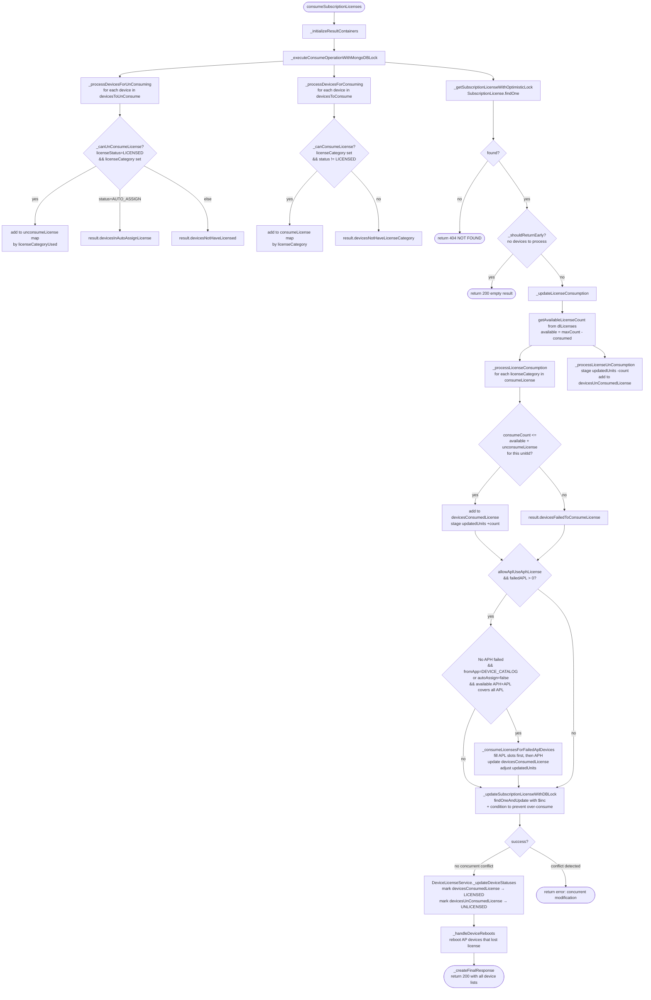

# CAPEX License Consumption — `consumeSubscriptionLicenses`

**Location:** `api/services/LicenseService.js`

---

## Purpose

Assigns (consumes) or releases (unconsumes) CAPEX subscription license units for a list of devices within an organization. Uses MongoDB `$inc` with a condition-based atomic update to prevent double-spending under concurrent requests.

---

## Signature

```js
consumeSubscriptionLicenses(
  orgId,                       // string   — organization ID
  devicesToConsumeLicense,     // Device[] — devices to assign a license to (default: [])
  devicesToUnConsumeLicense,   // Device[] — devices to release a license from (default: [])
  allowAplUseAphLicense,       // boolean  — OVNG-20141: APL devices may use an APH slot as fallback
  fromApp                      // string   — caller context, e.g. "DEVICE_CATALOG"
)
```

---

## Key Data Model

### `SubscriptionLicense`

| Field | Description |
|---|---|
| `dlLicenses[].units[].unitId` | License category identifier, e.g. `OVCX-APL`, `OVCX-APH`, `OVCX-68` |
| `dlLicenses[].units[].maxCount` | Total purchased seats for this unit |
| `dlLicenses[].expiredDate` | Epoch ms. 0 = never expires |
| `licenseConsumed[0].consumed` | `{ [unitId]: number }` — atomically incremented/decremented by `$inc` |
| `coterm` | If `true`, all `dlLicenses` share the same expiry and honour the grace period together |

### `Device` (relevant fields)

| Field | Description |
|---|---|
| `licenseCategory` | The license unit the device **needs** (set during registration/provisioning) |
| `licenseCategoryUsed` | The unit actually **assigned** (differs when APL device got an APH slot) |
| `licenseStatus` | `LICENSED` / `UNLICENSED` / `AUTO_ASSIGN` |

> **How `licenseCategory` is populated:**
> The `licenseCategory` field is **not set by this application**. It is written into the `DeviceDynamicAttribute` collection by the **infra microservice** during device provisioning/registration (hardware model detection maps to a license SKU). The application reads it from there in two places:
> - **Policy `isCachedDevicesHaveLicenseCategoryExisting`** — called before the bind/unbind API handler; validates all requested devices have `licenseCategory` in `DeviceDynamicAttribute` and attaches them to `req.cachedDevicesDynamicBySerialNumber`.
> - **VC join binding** — when a new device joins an existing licensed Virtual Chassis, the service reads `DeviceDynamicAttribute.licenseCategory` of the existing VC master and passes it to `LicenseService.autoBindingLicenses`.
>
> If the infra microservice has not yet written `licenseCategory`, all license assignment calls will fail eligibility (`_canConsumeLicense` returns `false`) and the device lands in `devicesNotHaveLicenseCategory`.

---

## Available License Formula

$$\text{available}[u] = \text{maxCount}[u] - \text{consumed}[u]$$

`maxCount` respects expiry:
- If the `dlLicense` entry is **not expired** → use `maxCount`.
- If expired but `coterm=true` and **within grace period** → still use `maxCount`.
- Otherwise → `0`.

---

## Device Eligibility

**To consume (assign) a license:**
- `device.licenseCategory` must be set.
- `device.licenseStatus !== LICENSED` (not already licensed).

**To unconsume (release) a license:**
- `device.licenseStatus === LICENSED`.
- `device.licenseCategory` must be set.

Devices that fail these checks are routed to the result containers below but **no error is thrown**.

---

## Result Containers

| Container | Meaning |
|---|---|
| `devicesConsumedLicense` | Successfully licensed in this call |
| `devicesFailedToConsumeLicense` | License pool exhausted for their category |
| `devicesNotHaveLicenseCategory` | `licenseCategory` was not set on the device |
| `devicesUnConsumedLicense` | Successfully unlicensed in this call |
| `devicesNotHaveLicensed` | Were not `LICENSED`, so nothing to release |
| `devicesInAutoAssignLicense` | Status was `AUTO_ASSIGN`; skipped for unconsuming |

---

## APL → APH Fallback  *(OVNG-20141)*

When `allowAplUseAphLicense=true` **and** some APL devices failed due to exhausted APL pool, the function checks whether remaining APH slots can cover them, under these conditions:

1. No APH-category device failed (APH pool is not exhausted).
2. `fromApp === "DEVICE_CATALOG"` **OR** the org setting `isAutoAssignLicenseForNewDevice === false`.
3. `available(APH) + available(APL) >= number of failed APL devices`.

When all conditions are met, the failed APL devices are re-assigned: left-over APL slots filled first, then APH slots for the remainder. Each device's `licenseCategoryUsed` reflects the actual slot consumed.

---

## Atomicity — `_updateSubscriptionLicenseWithDBLock`

Uses MongoDB `findOneAndUpdate` with a `$and` condition that prevents:
- **Over-consume:** `current + value <= maxCount` (enforced as `current <= maxCount - value`).
- **Over-release:** `current >= |value|` for negative `$inc`.

The `sanitizeUpdateUnits` helper also rejects any `updatedUnit` where `value > maxCount` before sending the query.

If the condition is not met (concurrent write won the race), `updateResult.success = false` is returned. The caller receives an error response; no device status is mutated.

---

## Flow Diagram



---

## Example Trace — Org `NewOrg8.17`

**SubscriptionLicense state before:**
```
dlLicenses maxCount: OVCX-APL=1, OVCX-APH=1, OVCX-68=2, OVCX-69=2
licenseConsumed[0].consumed: { OVCX-APL:1, OVCX-APH:1, OVCX-68:1, OVCX-69:0 }
```
**Available:** `OVCX-APL=0, OVCX-APH=0, OVCX-68=1, OVCX-69=2`

**Scenario:** Device `SSZ203900002` (LICENSED, `licenseCategoryUsed=OVCX-APL`) is deleted.
- **Call:** `consumeSubscriptionLicenses(orgId, [], [device_SSZ203900002])`
- `_canUnConsumeLicense` → `true` (LICENSED + licenseCategory set)
- `unconsumeLicense = { 'OVCX-APL': 1 }`
- `updatedUnits = { 'licenseConsumed.0.consumed.OVCX-APL': -1 }`
- `$inc` condition: current `OVCX-APL` consumed (1) ≥ 1 → passes
- Result: `devicesUnConsumedLicense=[SSZ203900002]`, consumed becomes `{ OVCX-APL:0 }`
- AP device → reboot triggered

---

## Response Shape

```json
{
  "status": "RESOURCE_SUCCESSFULLY_UPDATED",
  "statusCode": 200,
  "data": {
    "devicesConsumedLicense": [],
    "devicesFailedToConsumeLicense": [],
    "devicesNotHaveLicenseCategory": [],
    "devicesUnConsumedLicense": [],
    "devicesNotHaveLicensed": []
  }
}
```

Error responses (`DATABASE_ERROR`, `RESOURCE_NOT_FOUND`) are returned without throwing.

---

## Network Advisor Edge Variant — `consumeSubscriptionLicensesForNetworkAdvisorEdgedevice`

A simplified variant for **NA Edge devices** (deviceFamily managed by Network Advisor). Differences from the general function:

| Aspect | `consumeSubscriptionLicenses` | `consumeSubscriptionLicensesForNetworkAdvisorEdgedevice` |
|---|---|---|
| License categories | Multiple (APL, APH, 68, 69, …) | Single NA-ND category resolved from the org's `dlLicenses` |
| Category lookup | Set per-device in `DeviceDynamicAttribute` by infra microservice | Resolved once from `subscriptionLicense.dlLicenses` — the NA-ND unit present in the org's subscription |
| Device state target | `Device.licenseStatus` / `Device.markPremium` | **`DeviceLicense` collection** (separate document) |
| APL→APH fallback | Yes (OVNG-20141) | Not applicable |
| `fromApp` param | Used to gate fallback logic | Not needed |

**Why a separate collection?**  
An NA-Edge license is an **add-on feature** on a device (e.g. enabling the Advisor Edge analytics service), not a device-management permit. The existing `Device.licenseStatus` field tracks whether the management platform has a license to manage the device; it must not be overwritten by NA-Edge state. `DeviceLicense` is the dedicated store for this feature license.

---

## `DeviceLicense` Collection

**Location:** `api/models/DeviceLicense.js`

One document per device, keyed on `serialNumber` (unique). Upserted on every bind/unbind call.

| Field | Type | Description |
|---|---|---|
| `device` | ref → Device | Reference to the Device `_id` |
| `serialNumber` | string (unique) | Physical serial number. Upsert key. |
| `vcSerialNumber` | string \| null | VC master serial, if applicable |
| `deviceFamily` | string \| null | `AP`, `AOS`, … copied from Device at upsert time |
| `edgeNaLicenseStatus` | `"LICENSED"` \| `"UNLICENSED"` | Current NA-Edge feature license state |
| `edgeNaLicenseCategoryUsed` | string \| null | Actual NA-ND unitId consumed (e.g. `OVCX-NA-ND-3Y`). The duration suffix is retained as-is from the `dlLicenses` payload but is not interpreted by the backend. `null` when unlicensed. |

---

## `AdvisorEdgeLicenseService`

**Location:** `api/services/AdvisorEdgeLicenseService.js`

| Function | Purpose |
|---|---|
| `updateEdgeDeviceStatuses(devicesConsumedLicense, devicesUnConsumedLicense)` | Parallel upsert of both licensed and unlicensed arrays. Returns `[edgeLicensedDevices, edgeUnlicensedDevices]`. Mirror of `DeviceLicenseService._updateDeviceStatuses`. |
| `updateDevicesToEdgeLicensed(devices)` | Sets `edgeNaLicenseStatus=LICENSED` and writes `edgeNaLicenseCategoryUsed` from `device.licenseCategoryUsed`. |
| `updateDevicesToEdgeUnlicensed(devices)` | Sets `edgeNaLicenseStatus=UNLICENSED` and clears `edgeNaLicenseCategoryUsed` to `null`. |
| `_upsertDeviceLicense(device, statusData)` | Internal. `findOne` by `serialNumber` → `updateOne` if found, `create` if not. Errors are caught per-device; failed upserts return `null` and are filtered from the result array. |

**Why `findOne` + `updateOne/create` instead of a native upsert?**  
Waterline ORM (Sails.js) does not expose a native `upsert` method. Using `findOneAndUpdate` directly on the MongoDB driver bypasses lifecycle hooks and schema validation. The find-then-write pattern keeps all operations inside Waterline.

---

## License Category Resolution — How the Backend Selects the Right `unitId`

The OV backend does **not** interpret the duration suffix (`-1Y`, `-3Y`, `-5Y`, `-1M`) of any license category. Subscription Manager / Datalake pre-aggregates ordered licenses and returns **one consolidated license object per category** inside `dlLicenses`. The `unitId` carried in that object (e.g. `OVCX-NA-ND-3Y`) is used as-is for `$inc` keys and `licenseCategoryUsed` tracking.

### Category anatomy

Every license `unitId` follows the pattern:

```
{PREFIX}-{SUB_CATEGORY}-{DURATION}
```

| Segment | Source | Examples |
|---|---|---|
| **PREFIX** | Backend deployment option (`DEPLOYMENT_OPTION`) | `OVCX` (cloud / OVNG) or `OVTX` (Terra) |
| **SUB_CATEGORY** | Device family / feature, determined at **API request time** and validated against device data | `APL`, `APH`, `63`, `64`, `65`, `68`, `69`, `99`, `NA-ND`, `NA-PU` |
| **DURATION** | Ignored by backend; set by Subscription Manager when the subscription is created | `1Y`, `3Y`, `5Y`, `1M`, `10Y` |

### Resolution chain

1. **Deployment prefix** — The `OVCX` or `OVTX` prefix is inherent to the subscription; a cloud subscription only contains `OVCX-*` units, a Terra subscription only `OVTX-*` units. The backend does not need to branch on deployment option when selecting — it resolves the unit from whatever is present in the org's `dlLicenses`.

2. **Device management category** (`APL`, `APH`, `63`, `68`, …) — For standard device-management licenses (`consumeSubscriptionLicenses`):
   - The **infra microservice** writes `licenseCategory` into `DeviceDynamicAttribute` during device provisioning (hardware model detection → license SKU).
   - The policy `isCachedDevicesHaveLicenseCategoryExisting` validates the field exists before the API handler runs.
   - `OvngDeviceLicenseCategoryService.getLicenseCategories(licenseMode)` provides a device-model → category mapping table synced from DataPond. For CAPEX it reads the `licenseCategoryForCapex` column.
   - `DeviceUtilityService.populateLicenseCategoryForAnalyticDevice()` resolves the category from the device's `type` (model name) using this mapping.

3. **NA Edge sub-category** (`NA-ND`, future `NA-PU`) — For Network Advisor Edge feature licenses (`consumeSubscriptionLicensesForNetworkAdvisorEdgedevice`):
   - The category is **not** read from `DeviceDynamicAttribute`. It is resolved from the subscription's `dlLicenses` by scanning for the `"NA-ND"` substring in `unitId` via `_findNaEdgeUnitId()`.
   - Datalake returns at most one NA-ND entry per subscription. There is no "first match" ambiguity — the scan is a safety lookup, not a selection between multiple NA-ND entries.
   - **`NA-PU` (Power Unit) sub-category** is architecturally reserved but **not yet supported** in production. The constants file carries commented-out `OVTX-NA-PU-*` entries. When NA-PU support is added, a similar resolver (e.g. `_findNaPuUnitId`) must be introduced, and the API request must indicate which NA sub-category applies so the backend selects the correct counter.

### How the API request determines the sub-category

The UI sends the device selection (serial numbers) in the bind/unbind API request. The backend then:
1. Looks up each device in the `Device` collection to get `deviceFamily` and other attributes.
2. For **standard licenses**: reads `licenseCategory` from `DeviceDynamicAttribute` (set by infra). The API does not send the category — it is derived from the device's hardware model.
3. For **NA Edge licenses**: the API endpoint itself implies the sub-category (`NA-ND`). The backend resolves the matching `unitId` from `dlLicenses`. When `NA-PU` is supported, either the endpoint or a request parameter must distinguish between `NA-ND` and `NA-PU`.

### Unit ID patterns by deployment

| Deployment | Standard device examples | NA Edge |
|---|---|---|
| OVNG (cloud) | `OVCX-APL`, `OVCX-APH`, `OVCX-68`, `OVCX-69` | `OVCX-NA-ND-{duration}` |
| OVTX (Terra) | `OVTX-APL`, `OVTX-APH`, `OVTX-68`, `OVTX-69` | `OVTX-NA-ND-{duration}` |

> **Key rule:** The backend never hardcodes the deployment prefix. It always reads whatever `unitId` values are present in the org's actual `dlLicenses` entries.

