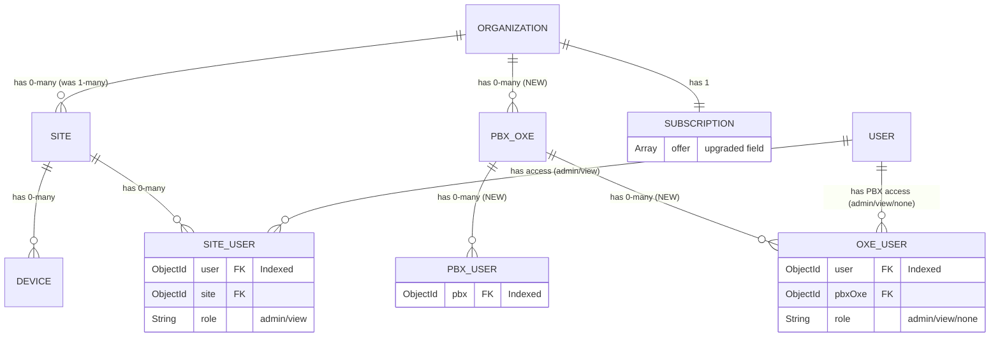

# MongoDB Collection Relation Schema

This document describes the current MongoDB collection relationship schema and the new enhancements introduced with the `offer` field upgrade in subscriptions.

## Overview

### Current Architecture (Before Upgrade)
- **Organization**: The root tenant. Automatically creates a default `Site` upon creation.
- **Subscription**: 1-to-1 relationship with `Organization`.
- **Site**: 1-to-many relationship with `Organization`.
- **Device**: 0-to-many relationship with `Site`.
- **SiteUser**: Manages user access (e.g., admin or view) to a specific `Site`. Acts as a mapping collection between `User` and `Site`.

### New Architecture (With Upgrade)
- **Organization**: Now supports 0-to-many `Site`s and introduces 0-to-many `pbxOxe`s based on the new `offer` field in the `Subscription` collection.
- **pbxOxe (NEW)**: Represents a PBX instance linked to an `Organization`. Supports 0-to-many `pbxUser`s and 0-to-many `OxeUser`s.
- **pbxUser (NEW)**: Represents a user configured on a `pbxOxe`.
- **OxeUser (NEW)**: Controls user access to a `pbxOxe` (admin/view/none), similar to `SiteUser` for sites.

## Entity-Relationship Diagram

## Scaling and Indexing Guidelines

To support the heavy load projected for the new entities, specific indexing and querying constraints are enforced:

### 1. `Organization` Collection
- **Volume**: A single cluster can hold **more than 5,000 organizations**. Full-collection scans are strictly prohibited.
- **Querying Rule**: Never query all organizations without a scoping filter (`msp`, `id $in`, or equivalent). Admin endpoints that list organizations **must always receive a scoping parameter** (`mspId` to return MSP-affiliated orgs, or a falsy value to return non-MSP orgs only). Fetching all organizations in memory at once must not happen in any production code path.
- **Indexing**: The `msp` field **must be indexed** to support fast MSP-scoped lookups.

### 2. `pbxUser` Collection
- **Volume**: Supports up to 50,000 documents per `Organization` and up to 500,000 documents in total across the database.
- **Indexing**: The `pbx` reference field **must be indexed** to ensure quick lookups.
- **Querying Rule**: Any query resolving `pbxUser` data **MUST be paginated**. Fetching unbounded data sets from this collection is strictly prohibited to prevent massive memory overhead.

### 2. `SiteUser` Collection
- **Indexing**: The `user` reference field **must be indexed**. This facilitates rapid querying of all sites a specific user has access to.

### 3. `OxeUser` Collection
- **Purpose**: Controls user access to a PBX (`pbxOxe`) with a `role` field (`admin`, `view`, `none`).
- **Indexing**: The `user` reference field **must be indexed** for fast lookup of PBX permissions per user.
