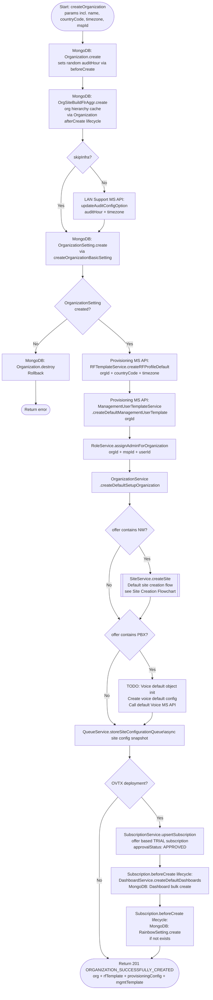
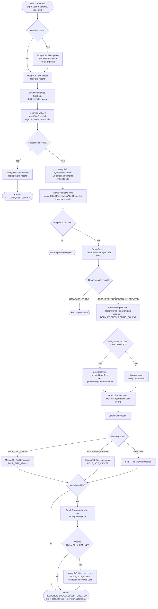
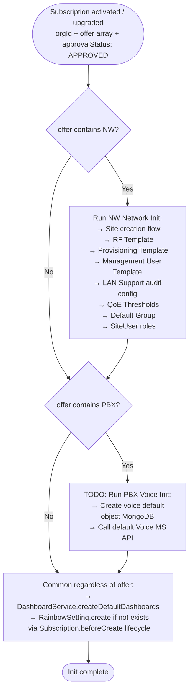

# Organization & Site Creation — Workflow Documentation

## Overview

This document covers two creation flows:

1. **Organization creation** — `OrganizationService.createOrganization` + `createDefaultSetupOrganization`, orchestrated by `OrganizationController.createOrganization`.
2. **Site creation** — `SiteService.createSite`, called as part of organization setup or standalone.

Both flows are gated by the **subscription offer** (`offer` array in `Subscription`):
- `"NW"` (Network) → full network init (default site, RF template, provisioning, QoE thresholds, groups, site-user roles).
- `"PBX"` (Voice/PBX) → voice default objects init (see TODO section).
- `["NW", "PBX"]` → both flows execute independently.

---

## 1. Organization Creation Flow

### Default Objects / Data Created

#### MongoDB (Waterline / Sails)

| # | Model | Description | Condition |
|---|-------|-------------|-----------|
| 1 | `Organization` (create) | New org record with `name`, `countryCode`, `timezone`, `imageUrl`, `idleTimeout`, `auditHour` (random), `msp` | Always |
| 2 | `OrgSiteBuildFlrAggr` (create) | Hierarchy cache entry for the org (lifecycle `afterCreate` on `Organization`) | Always, via model lifecycle |
| 3 | `OrganizationSetting` (create) | Basic org settings via `OrganizationSettingService.createOrganizationBasicSetting` | Always — failure rolls back `Organization` |
| 4 | `Subscription` (create) | Trial subscription with `offer: ["NW"]`, `approvalStatus: "APPROVED"`, 90-day duration | **OVTX deployment only**, after default setup succeeds |
| 5 | `Dashboard` (create, bulk) | Default dashboards for the org, via `DashboardService.createDefaultDashboards` (lifecycle triggered) | Inside `Subscription.beforeCreate` when `approvalStatus === "APPROVED"` |
| 6 | `RainbowSetting` (create) | Basic Rainbow/UCaaS org settings, created if not exists | Inside `Subscription.beforeCreate` when `approvalStatus === "APPROVED"` |

> **Rollback:** If `OrganizationSetting` creation fails, the `Organization` record is destroyed immediately.

#### External Microservice APIs

| # | Service | Operation | Description | Condition |
|---|---------|-----------|-------------|-----------|
| 7 | LAN Support MS | `updateAuditConfigOption` | Registers audit config (auditHour + timezone) for the new org | Always, unless `skipInfra = true` |
| 8 | Provisioning MS | `RFTemplateService.createRFProfileDefault` | Creates the default RF profile template for the org | Always |
| 9 | Provisioning MS | `ManagementUserTemplateService.createDefaultManagementUserTemplate` | Creates the default management user template for the org | Always |

#### Role & Access

| # | Operation | Description | Condition |
|---|-----------|-------------|-----------|
| 10 | `RoleService.assignAdminForOrganization` | Assigns `ROLE_ORG_ADMIN` | Always |

#### Default Site (called from `createDefaultSetupOrganization`)

After the org is created, a **default site** is immediately created via `SiteService.createSite`. See **Section 2** for the full site creation object list and flowchart.

| # | Async Operation | Description |
|---|-----------------|-------------|
| 11 | `QueueService.storeSiteConfigurationQueue` | Enqueues a job to persist site configuration snapshot | After default site created |

---

### Organization Creation Flowchart

---

## 2. Site Creation Flow

> **Offer gate:** The site creation flow (and all objects below) only applies when the subscription `offer` contains `"NW"` (Network). For a `"PBX"`-only subscription, site creation is skipped and the voice init path runs instead.

### Default Objects / Data Created

#### MongoDB (Waterline / Sails)

| # | Model | Description | Condition |
|---|-------|-------------|-----------|
| 1 | `Site` (create) | New site record with location and basic info | Always |
| 2 | `QoEParam` (create) | 20 default QoE thresholds linked to the new site | Always (after reporting MS succeeds) |
| 3 | `SiteUser` (create, bulk) | One `SiteUser` record per org member with a mapped role | Always, for each qualifying org user |

> **Rollback:** If the Reporting MS call fails, the newly created `Site` record is immediately destroyed (`Site.destroy`) before returning an error.

### External Microservice APIs

| # | Service | Operation | Description | Condition |
|---|---------|-----------|-------------|-----------|
| 6 | Reporting MS | `upsertSiteThreshold` | Registers 20 QoE threshold values for the new site | Always — **blocking gate**: failure rolls back site creation |
| 7 | Provisioning MS | `createDefaultProvisioningAfterCreateSite` | Creates a default provisioning template scoped to the new site (includes `timeZone`, `siteId`) | Always after reporting MS succeeds |
| 8 | Group MS / DB | `createDefaultGroupForSite` | Creates the default AP device group for the site | Always after provisioning template succeeds |
| 9 | Provisioning MS | `assignProvisioningTemplate` | Assigns the default provisioning template (`DEFAULT_PROVISIONING_CONFIG`) to the new default group | Only when default group is created successfully |
| 10 | Group MS / DB | `updateGroupById` | Updates the group's `provisioningTemplateName` to `DEFAULT_PROVISIONING_CONFIG` | Only when provisioning template assignment succeeds (status 200 or 201) |

---

### Site Creation Flowchart

---

## 3. Subscription Offer — Init Branch Summary

The `offer` array on the `Subscription` record controls which default objects are provisioned. This applies both during the **initial organization creation** (**OVTX** auto-subscription) and for **any future subscription activation/upgrade**.

| `offer` value | NW init (site + network stack) | PBX init (voice stack) |
|---------------|-------------------------------|------------------------|
| `["NW"]` | ✅ Run (default) | ❌ Skip |
| `["PBX"]` | ❌ Skip | ✅ Run |
| `["NW", "PBX"]` | ✅ Run | ✅ Run |

### NW (Network) Init — Objects Created

All objects listed in **Section 2 (Site Creation)** plus **Section 1 org-level** objects (RF template, provisioning template, management user template, LAN Support audit config).

### PBX (Voice) Init — Objects Created

> **TODO:** Voice/PBX default initialization is not yet defined. When implemented, this section should cover:
>
> - `voice default object` — MongoDB creation of a default voice configuration record linked to the org.
> - `call default Voice MS API` — External API call to the Voice/PBX microservice to register the organization and provision default voice settings.
>
> The exact model names, API endpoints, and rollback strategy are pending architecture decision.

### Offer-Based Branching Flowchart

