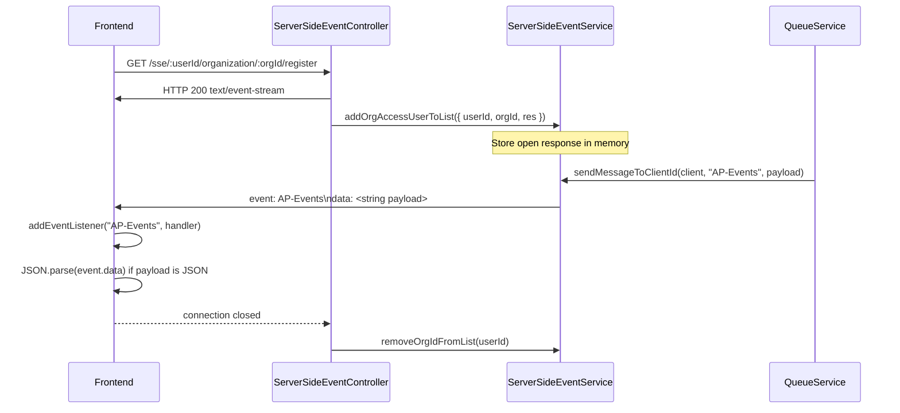

# Server-Side Event Workflow

## Overview

This document explains how the backend publishes Server-Side Events (SSE), how the frontend subscribes to them, and how event payloads are delivered to the browser.

The common message publishing pattern is:

```js
ServerSideEventService.sendMessageToClientId(input.client, "AP-Events", input.alertData);
```

In that example:

- `input.client` is the registered SSE client, including the HTTP response object kept open by the backend.
- `AP-Events` is the SSE event name used by the frontend listener.
- `input.alertData` is the message payload written to the event stream.

## End-to-End Flow

### 1. Frontend subscribes to the SSE endpoint

When the user is logged in, the frontend opens an SSE connection to the backend.

In the current backend implementation, the registered route is:

- `GET /sse/:userId/organization/:orgId/register`

This route is defined in [routes/web/routes.js](../../routes/web/routes.js) and handled by [api/controllers/v1/ServerSideEventController.js](../../api/controllers/v1/ServerSideEventController.js).

The controller prepares the response as an SSE stream by setting:

- `Content-Type: text/event-stream`
- `Connection: keep-alive`
- `Cache-Control: no-cache`

Then it writes an initial newline to start the stream and keeps the response open.

### 2. Backend stores the open response

After the subscription request reaches the controller, the backend stores the open response object so it can continue writing messages later without creating a new HTTP response.

This registration is handled by [api/controllers/v1/ServerSideEventController.js](../../api/controllers/v1/ServerSideEventController.js) through:

```js
await ServerSideEventService.addOrgAccessUserToList({ userId, orgId, res });
```

The service stores the client in in-memory global state:

- `sails.config.globals.globalSse.clientsAccessOrg`
- `sails.config.globals.clientBySiteAccess`

That stored response is the same object later used by `sendMessageToClientId()`.

### 3. Backend receives or generates a notification

When the backend detects a new alert, AP trap, AOS trap, or another notification source, it routes the data through `QueueService`.

Examples from [api/services/QueueService.js](../../api/services/QueueService.js):

```js
ServerSideEventService.sendMessageToClientId(input.client, "Alerts", input.alertData);
ServerSideEventService.sendMessageToClientId(input.client, "AP-Events", input.alertData);
ServerSideEventService.sendMessageToClientId(input.client, "AOS-Events", input.alertData);
```

This means the queue decides which SSE event name is sent to the browser.

### 4. Backend writes the SSE frame to the client response

The actual SSE message is written by [api/services/ServerSideEventService.js](../../api/services/ServerSideEventService.js) in `sendMessageToClientId()`.

The method writes the message using standard SSE format:

```text
retry: 5000
event: AP-Events
id:<client id>
data: <payload>

```

Important details:

- `event` is the event name the frontend listens to.
- `data` is always written as a string.
- `retry: 5000` tells the browser to retry the connection after 5 seconds if the stream is disconnected.
- The response is flushed when supported so the browser receives the event immediately.

## Event Payload Format

All messages sent by the backend are written as strings.

If the payload is a JSON object, convert it before sending:

```js
JSON.stringify(payload)
```

Then parse it on the frontend:

```js
const data = JSON.parse(event.data);
```

Example:

```js
QueueService.sendLiveNotificationToConnectedClientsMessageQueue(
    JSON.stringify({
        count,
        siteId
    }),
    siteId,
    notificationType
);
```

## Frontend Listener Pattern

The browser keeps the HTTP request open and listens for named SSE events.

Example frontend usage:

```js
const eventSource = new EventSource(`/sse/${userId}/organization/${orgId}/register`);

eventSource.addEventListener("AP-Events", function (event) {
    const data = JSON.parse(event.data);
    // handle AP event
});
```

The frontend must listen with the exact event name written by the backend. If the backend sends `AP-Events`, then the frontend must register `addEventListener("AP-Events", ...)`.

## Keep-Alive Requirement

Browsers, especially Google Chrome, may close an inactive SSE connection after a period without traffic. To keep the stream alive, the server should periodically write a lightweight message before the browser decides the connection is idle.

Expected behavior:

- send a keep-alive message about every 1 minute 50 seconds
- keep the SSE HTTP response active
- avoid letting the browser close the idle stream

Typical keep-alive payloads are empty data frames or comment frames.

Note:

- The SSE controller and service in the current code path clearly set the stream headers, keep the response open, and write normal event frames.
- The periodic keep-alive write is an important SSE operational requirement, but it is not implemented inside the `sendMessageToClientId()` path shown in this document.
- If a keep-alive mechanism exists elsewhere in the platform, it should use the same stored response object and write to the open stream before browser timeout.

## Connection Lifecycle

The lifecycle is:

1. Frontend opens the SSE request.
2. Backend returns `text/event-stream` and keeps the response open.
3. Backend stores the response object in memory.
4. Backend writes named SSE events to that response whenever notifications arrive.
5. Frontend catches the event by name and processes the string payload.
6. When the request closes, the backend removes the stored client entry.

Client cleanup is handled from [api/controllers/v1/ServerSideEventController.js](../../api/controllers/v1/ServerSideEventController.js) through the request `close` listener, which calls `ServerSideEventService.removeOrgIdFromList(userId)`.

## Sequence Summary



## Key Rules

- SSE event names must be consistent between backend and frontend.
- The backend writes string payloads only.
- Use `JSON.stringify()` before sending structured data.
- Use `JSON.parse()` on the frontend when needed.
- Keep the response object alive and reusable until the client disconnects.
- Add a periodic keep-alive write to avoid idle browser disconnects.