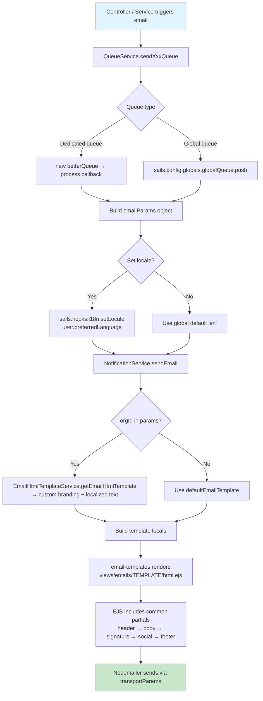
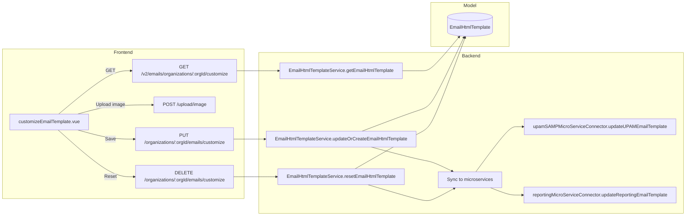

# Email Mechanism

TLDR: `QueueService` prepares email payloads, `NotificationService` builds the mail transport and renders templates, `email-templates` + `EJS` generate the HTML, `sails.__()` resolves translated strings, and `EmailHtmlTemplateService` overlays organization-specific text and branding before the message is sent.

---

## Runtime Flow
- `QueueService` is the common entry point for queued email sending. It builds `emailParams`, often sets the active locale with `sails.hooks.i18n.setLocale(...)`, then calls `NotificationService.sendEmail(...)`.
- `NotificationService.sendEmail(...)` creates the Nodemailer transport from `sails.config.globals.transportParams`.
- `transportParams` is initialized during bootstrap in `config/bootstrap.js` from `sails.config.email`, which is populated by `config/env/*.js`.
- `email-templates` loads the template folder from `views/emails`, renders `html.ejs` using EJS, then sends the result through Nodemailer.
- `NotificationService.sendEmailUsingDBTemplate(...)` is a separate path that renders HTML from the `EmailTemplate` database model with simple `{{key}}` replacement instead of using the EJS folder-based templates.

---

## Packages Used
- `nodemailer`: SMTP transport creation and actual message delivery.
- `email-templates`: template discovery, EJS rendering integration, and optional preview support.
- `ejs`: HTML layout rendering, partial includes, and variable interpolation inside `views/emails/**/*.ejs`.
- `better-queue`: asynchronous queue orchestration for mail-triggering flows in `QueueService`.
- `path`: resolves the email template root folder.
- `fs`: reads the optional CA certificate when SMTP TLS CA is enabled.
- `axios`: used in bootstrap only for OAuth2 token retrieval when `EMAIL_AUTH_TYPE=oauth2`.

---

## Render Mechanism
- Folder-based email templates live under `views/emails/<template-name>/html.ejs`.
- Shared layout fragments are included with EJS partials such as `../common/header`, `../common/signature`, `../common/socialnetworks`, and `../common/footer`.
- `NotificationService.sendEmail(...)` passes these locals to the template:
  - `emailParams.params`: business data for the template.
  - `ovName`: resolved product name (`OmniVista Cirrus` or `OmniVista Terra`).
  - `template`: the branding and translated layout block used by common partials.
- Subjects are prefixed at send time with `[OmniVista Cirrus]` or `[OmniVista Terra]`.
- `previewInBrowser` is supported by `email-templates` for local environments, but it is not part of the cluster env sample.

---

## Translation Model
- Static translation keys used in the HTML layout come from `config/locales/*.json` through `sails.__("translation_key", ...args)`.
- The active locale depends on the current i18n context. Several queue methods explicitly set it before sending, for example with `sails.hooks.i18n.setLocale(user.preferredLanguage || "en")`.
- `EmailHtmlTemplateService` also maintains language-specific customizable text blocks for `en`, `fr`, `cn`, `es`, `de`, and `ja`.
- `NotificationService.sendEmail(...)` resolves the organization email template first when `emailParams.params.orgId` is present. If a custom organization template exists, it uses the language block matching `sails.hooks.i18n.getLocale()`. Otherwise it falls back to `defaultEmailTemplate`.
- When explaining the system, distinguish two text sources clearly:
  - `config/locales/*.json`: translation strings referenced directly in EJS with `sails.__()`.
  - `defaultEmailTemplate` and `EmailHtmlTemplate`: customizable layout text injected through the `template` local.

---

## Customizable Text And Media
- Organization-specific email branding is stored through `EmailHtmlTemplateService`.
- Customizable media:
  - Banner/header image: stored in `img.header`, exposed to templates as `header_mail_img`.
  - Logo image: stored in `img.logo`, exposed to templates as `logoALE_img`.
- Static social icons remain sourced from the default template image set unless changed in code.
- Customizable text comes from the language objects (`en`, `fr`, `cn`, `es`, `de`, `ja`) stored in the template document and merged over `defaultEmailTemplate`.
- `EmailHtmlTemplateService.getEmailHtmlTemplate(...)` expands relative image paths into full backend URLs when `isFullUrl=true`.
- The service also replaces `ALE_NAME`, `OV_NAME`, and `YEAR` placeholders before returning the merged template.
- When new custom images are saved, `ImageAccess` entries are created with `PUBLIC` access and old media is cleaned up when replaced.

---

## Environment Mapping
- `EMAIL_HOST` -> `sails.config.email.host` -> Nodemailer `host`
- `EMAIL_PORT` -> `sails.config.email.port` -> Nodemailer `port`
- `EMAIL_FROM` -> sender address used by `email-templates` and DB-template sends
- `EMAIL_AUTHENTICATION` -> if `true`, bootstrap adds `transportParams.auth` from `EMAIL_USER` and `EMAIL_PASSWORD`
- `EMAIL_IGNORE_TLS` -> Nodemailer `ignoreTLS`
- `EMAIL_SECURE` -> Nodemailer `secure`
- `EMAIL_TLS_IS_CA_USED` -> if `true`, bootstrap loads `config/ca/ca.pem` into `transportParams.tls.ca`
- `EMAIL_TLS_REJECT_UNAUTHORIZED` -> Nodemailer `tls.rejectUnauthorized`
- `EMAIL_AUTH_TYPE=oauth2` switches auth initialization to Microsoft OAuth2 token retrieval in bootstrap

For the provided cluster sample:
- `EMAIL_AUTHENTICATION: "false"` means SMTP auth is not added to `transportParams.auth`.
- `EMAIL_IGNORE_TLS: "true"` means Nodemailer is allowed to skip STARTTLS negotiation.
- `EMAIL_SECURE: "false"` means the transport is not using implicit TLS.
- `EMAIL_TLS_IS_CA_USED: "false"` means no CA file is loaded.
- `EMAIL_TLS_REJECT_UNAUTHORIZED: "false"` means certificate validation is explicitly relaxed.
- `EMAIL_FROM` is the visible sender.
- `ADMIN_EMAIL_ERROR` is an operational contact value and is not part of the Nodemailer transport setup shown here.

---

## Email Sending Architecture (Data Flow)



---

## QueueService Email Functions — Complete Catalog

### Queue Patterns

| Pattern | Mechanism | When to Use |
|---------|-----------|-------------|
| **Dedicated queue** | `new betterQueue(cb)` per invocation | Most email functions — simple fire-and-forget |
| **Global queue** | `sails.config.globals.globalQueue.push({type, ...})` | Subscription flows, MSP change, account creation |
| **Promise-based** | Returns Promise from queue finish/failed | When caller needs to await completion |

### User & Authentication Emails

| Function | Template | Subject Key | Locale Set? | Params |
|----------|----------|-------------|-------------|--------|
| `sendNewUsersInvitationsQueue(invitations[])` | `user_email_invitation` | `invite_new_user_to_OVNG_mail_subject` | No (global) | inviteeName, inviterNickname, mspName, organizationName, orgId, text, verifyUrl |
| `sendUnlockAccountQueueEmail(admins[])` | `user_email_reset_lock_account` | `user_reset_lock_account_mail_subject` | No | userFullname, firstname, orgId, email, resetUrl |
| `sendResetTwoFAQueueEmail(admins[])` | `admin_email_reset_tfa` | `admin_reste_tfa_mail_subject` | No | userFullname, adminFirstname, orgId, userIsAdmin, verifyUrl |
| `sendLockedUserMailQueue(user, duration)` | `user_email_lock_account` | `user_locked_account_mail_subject` | **Yes** | orgId, firstname, duration (minutes), verifyUrl |
| `sendAccountEmailCreationMailQueue(user)` | `user_account_creation` | `user_email_create_account_mail_subject` | **Yes** | firstname |

### Subscription Emails

| Function | Template | Subject Key | Locale Set? |
|----------|----------|-------------|-------------|
| `sendRemindSubscriptionExpiration(requesters[])` | `subscription_remind` | `subscription_remind_mail_subject` | **Yes** |
| `sendInformSubscriptionResultToRequester(sub, status)` | Dynamic (5 templates) | Dynamic | **Yes** |
| `sendNewTrialSubscriptionRequestQueue(emailData)` | `trial_subscription_created` | `subscription_new_trial_subscription_mail_subject` | **Yes** (forced "en") |
| `sendNewModificationOfSubscriptionRequestQueue(emailData)` | `subscription_more_devices` | `subscription_more_devices_subscription_mail_subject` | **Yes** (forced "en") |
| `sendRenewalOfSubscriptionRequestQueue(emailData)` | `subscription_renewal_info` | `subscription_renew_subscription_mail_subject` | **Yes** (forced "en") |
| `sendUpdateOfSubscriptionMailQueue(subscription)` | `subscription_update_info` | `subscription_update_subscription_mail_subject` | **Yes** |
| `sendNotifyRemindSubscriptionLicenseExpiration(requesters[])` | Dynamic (DB template) | — | **Yes** |

### Organization & System Emails

| Function | Template | Subject Key | Locale Set? |
|----------|----------|-------------|-------------|
| `sendRequestChangeMsp(params)` | `organization_change_msp_request` | `organization_change_msp_request` | No |
| `sendServerErrorMailQueue(emailData)` | `server_met_error_mail` | Hardcoded server error | No |
| `sendCollectionAsCSVByEmailMailQueue(entries, email, name)` | `extract_csv_collection` | Hardcoded "CSV Export" | No |
| `sendNewResumeDataKpiDashboardRequestQueue(emailData, csv, filename)` | `monthly_resume_kpiDashboard` | `msp_dashboard_email_data_resume` | **Yes** (forced "en") |

---

## EJS Template Folder Structure

```
views/emails/
├── common/                         ← Shared partials (included in all templates)
│   ├── header.ejs                  ← HTML head + header image banner
│   ├── signature.ejs               ← "Thanks, The OV Team" block
│   ├── socialnetworks.ejs          ← LinkedIn/Twitter/YouTube/Facebook icons + logo
│   └── footer.ejs                  ← Copyright + "Learn about" + confidentiality
│
├── user_email_invitation/html.ejs  ← Invitation to join MSP/Org
├── user_email_verification/html.ejs← Email confirmation after signup
├── user_email_reset/html.ejs       ← Password reset link
├── user_email_lock_account/html.ejs← Account locked notification
├── user_email_reset_lock_account/html.ejs ← Admin unlock account
├── user_account_creation/html.ejs  ← Account created confirmation
├── user_check_email_with_digits_token/html.ejs ← 2FA digits code
│
├── admin_email_reset_tfa/html.ejs  ← Admin: disable 2FA request
│
├── subscription_remind/html.ejs
├── subscription_inform_status/html.ejs
├── subscription_more_devices/html.ejs
├── subscription_moreDevice_info/html.ejs
├── subscription_moreDevice_reject/html.ejs
├── subscription_renewal_approve/html.ejs
├── subscription_renewal_info/html.ejs
├── subscription_renewal_reject/html.ejs
├── subscription_update_info/html.ejs
├── trial_subscription_created/html.ejs
│
├── organization_change_msp_request/html.ejs
├── extract_csv_collection/html.ejs
├── monthly_resume_kpiDashboard/html.ejs
├── server_met_error_mail/html.ejs
├── rainbow_account_error/html.ejs
├── rainbow_bubble_no_longer_exist/html.ejs
└── rainbow_generic_account_error/html.ejs
```

### Common Partials — EJS Variables

| Partial | Variables Used | Source |
|---------|---------------|--------|
| `header.ejs` | `subject`, `template.header_mail_img`, `template.frontend_url` | emailParams.params + EmailHtmlTemplateService |
| `signature.ejs` | `template.common_mail_regards`, `template.common_mail_team`, `ovName` | defaultEmailTemplate / org custom |
| `socialnetworks.ejs` | `template.linkedIn_img`, `template.twitter_img`, `template.youtube_img`, `template.facebook_img`, `template.logoALE_img` | defaultEmailTemplate / org custom |
| `footer.ejs` | `template.common_mail_learn_about`, `template.common_mail_copyright`, `template.common_mail_confidential`, `ovName` | defaultEmailTemplate / org custom |

### EJS Template Pattern (every template follows this)

```ejs
<%- include("../common/header", { subject, ...template }) %>

<!-- Template-specific body content -->
<p><%- sails.__("some_locale_key", variable) %></p>
<a href="<%= verifyUrl %>"><%- sails.__("button_text_key") %></a>

<%- include("../common/signature", { ...template, ovName }) %>
<%- include("../common/socialnetworks", { ...template }) %>
<%- include("../common/footer", { ...template, ovName }) %>
```

---

## Email Template Customization (Organization Branding)

### Architecture



### What Can Be Customized (per Organization)

| Element | Storage | Frontend Control | Default Source |
|---------|---------|-----------------|----------------|
| Header banner image | `img.header` → ImageAccess (PUBLIC) | Upload jpeg/png button | `/images/static/emails/header_mail.png` |
| Logo image | `img.logo` → ImageAccess (PUBLIC) | Upload jpeg/png button | `/images/static/emails/logoALE.png` |
| "Learn more about" text | `{lang}.common_mail_learn_about` | Edit pencil icon | `defaultEmailTemplate` |
| Copyright text | `{lang}.common_mail_copyright` | Edit pencil icon | `defaultEmailTemplate` |
| Regards text | `{lang}.common_mail_regards` | Edit pencil icon | `defaultEmailTemplate` |
| Team name text | `{lang}.common_mail_team` | Edit pencil icon | `defaultEmailTemplate` |
| Confidentiality text | `{lang}.common_mail_confidential` | Edit pencil icon | `defaultEmailTemplate` |

### Customization per Language

The `EmailHtmlTemplate` model stores separate text blocks for each supported language:
- `en`, `fr`, `cn`, `es`, `de`, `ja`

Each language object contains keys: `common_mail_learn_about`, `common_mail_copyright`, `common_mail_regards`, `common_mail_team`, `common_mail_confidential`.

### Placeholder Substitution

Before returning, `EmailHtmlTemplateService` replaces these placeholders in all language text:
- `ALE_NAME` → `sails.config.corpName` (e.g., "Alcatel-Lucent Enterprise")
- `OV_NAME` → `"OmniVista Terra"` or `"OmniVista Cirrus"` (based on `DEPLOYMENT_OPTION`)
- `YEAR` → current year

### Frontend Page

| File | Purpose |
|------|---------|
| `frontend/src/components/organization/customizeEmailTemplate.vue` | Email template preview + edit UI |
| `frontend/src/store/modules/customEmailTemplate.js` | Store module for API calls |

**Store Actions:**
- `getCustomEmailTemplate(orgId)` → `GET /v2/emails/organizations/{orgId}/customize`
- `loadImagesAndUpdateEmailTemplate({header, logo, messages, orgId})` → Upload images then `PUT /organizations/{orgId}/emails/customize`
- `resetCustomEmailTemplate({orgId})` → `DELETE /organizations/{orgId}/emails/customize`
- `deployCustomEmailTemplate(orgId)` → `PUT /organizations/{orgId}/emails/customize/deploy`

### Microservice Sync

When email template is updated/reset, `EmailHtmlTemplateService.updateMSEmailTemplate()` syncs to:
1. **UPAM microservice** (Guest Access) — via `upamSAMPMicroServiceConnector.updateUPAMEmailTemplate()`
2. **Reporting microservice** — via `reportingMicroServiceConnector.updateReportingEmailTemplate()`

Both must succeed for the operation to be considered successful (countSuccessUpdated === 2).

---

## Two Email Rendering Paths

| Path | Service Method | Template Source | Variable Syntax | Use Case |
|------|---------------|-----------------|-----------------|----------|
| **EJS folder** | `NotificationService.sendEmail(emailParams)` | `views/emails/<template>/html.ejs` | `<%= var %>` / `<%- sails.__() %>` | All standard emails |
| **DB template** | `NotificationService.sendEmailUsingDBTemplate(emailParams)` | `EmailTemplate` model (templateContent) | `{{key}}` replacement | License expiration reminders, custom admin templates |

### DB Template Path (`sendEmailUsingDBTemplate`)
- Fetches `EmailTemplate` by `templateName`
- Replaces `{{key}}` patterns in `templateContent` with `emailParams.params` values
- Sends via Nodemailer directly (no email-templates package, no common partials)
- Used by: `sendNotifyRemindSubscriptionLicenseExpiration`

### DB Template Model (`EmailTemplate`)
- `templateName` — unique identifier
- `templateSubject` — email subject
- `templateContent` — full HTML with `{{key}}` placeholders
- `from` — optional sender override
- Managed via `EmailTemplateService.createOrUpdateEmailTemplate(req)` (file upload)

---

## How to Add a New Email Type

### Step 1: Create EJS Template
```
views/emails/my_new_email/html.ejs
```
```ejs
<%- include("../common/header", { subject, ...template }) %>

<p><%- sails.__("my_new_email_content", firstname) %></p>
<a href="<%= actionUrl %>" style="..."><%- sails.__("my_new_email_button") %></a>

<%- include("../common/signature", { ...template, ovName }) %>
<%- include("../common/socialnetworks", { ...template }) %>
<%- include("../common/footer", { ...template, ovName }) %>
```

### Step 2: Add Locale Keys
In `config/locales/en.json` (and other languages):
```json
"my_new_email_subject": "Your action is needed",
"my_new_email_content": "Hi %s, please complete your action.",
"my_new_email_button": "Take Action"
```

### Step 3: Add Queue Function in QueueService
```javascript
sendMyNewEmailQueue(params) {
    const emailQueue = new betterQueue((input, cb) => {
        sails.hooks.i18n.setLocale(input.preferredLanguage || "en");
        const emailParams = {
            template: "my_new_email",
            subject: sails.__("my_new_email_subject"),
            to: [input.email],
            cc: [], bcc: [], attachments: [],
            params: {
                subject: sails.__("my_new_email_subject"),
                orgId: input.orgId,  // Required for org branding
                firstname: input.firstname,
                actionUrl: input.actionUrl
            }
        };
        NotificationService.sendEmail(emailParams);
        cb(null);
    });
    emailQueue.push(params);
}
```

### Step 4: Call from Controller/Service
```javascript
QueueService.sendMyNewEmailQueue({
    email: user.email,
    preferredLanguage: user.preferredLanguage,
    orgId: orgId,
    firstname: user.firstname,
    actionUrl: sails.config.frontendUrl + "/action?token=" + token
});
```

### Checklist for New Email
- [ ] EJS template in `views/emails/<name>/html.ejs`
- [ ] Includes all 4 common partials (header, signature, socialnetworks, footer)
- [ ] Locale keys in ALL `config/locales/*.json` files
- [ ] `orgId` passed in params for organization branding
- [ ] `subject` key duplicated in params (used by header partial)
- [ ] Locale set via `sails.hooks.i18n.setLocale()` before building emailParams
- [ ] Queue function uses `betterQueue` or global queue pattern

---

## Documentation Rules
- When documenting or reviewing this area, always describe both email paths:
  - EJS folder templates via `sendEmail(...)`
  - Database HTML templates via `sendEmailUsingDBTemplate(...)`
- Always mention where the locale is set before claiming a template is translated.
- Always mention that organization branding requires `orgId` in `emailParams.params`.
- Do not describe header/logo customization as frontend-only; it is driven by backend template data and image storage.
- Do not assume TLS auth is enabled; derive it from env-backed `sails.config.email`.
- When adding a new email, always include `subject` in both the top-level emailParams AND inside `params` (header partial reads it from locals).