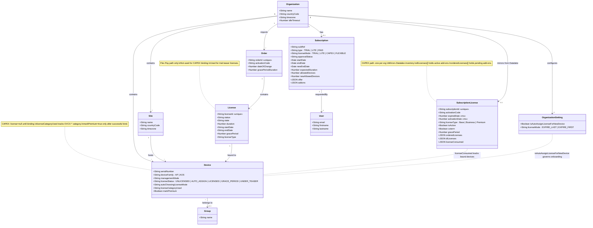

# PAID CAPEX Subscription

TLDR: Treat CAPEX as a subscription-first flow. One organization maps to one subscription. `SubscriptionLicense` is the OVNG mirror of Datalake inventory, and CAPEX device onboarding should create `AUTO_ASSIGN` or `UNLICENSED` devices before any later binding step.

## Dual License Model Awareness
- OVNG supports two paid models side by side: **Flex Pay** (order-based via MyPortal / Service Manager) and **CAPEX Subscription** (Subscription Manager based).
- Flex Pay uses `Order` + `License` records; each order co-terminates internally but different orders expire independently.
- CAPEX uses `Subscription` + `SubscriptionLicense`; one subscription per org for its entire lifecycle.
- Code that touches license management must check `Subscription.licenseMode` to branch correctly. Never apply Order-based activation logic when `licenseMode === "CAPEX"` and vice versa.

## Domain Invariants
- CAPEX logic applies when `Subscription.type === "PAID"` and `Subscription.licenseMode === "CAPEX"`.
- Keep the org-level contract: one organization maps to one `subscriptionId` for the lifetime of the organization unless a dedicated migration story says otherwise.
- `SubscriptionLicense` is the local persistence model for CAPEX inventory mirrored from Datalake or Subscription Manager. Keep `subscriptionId`, `activationCode`, `expiredDate`, `activationDate`, `coterm`, `dlLicenses`, `orderedLicenses`, `licenseConsumed`, `isActive`, and `organization` aligned with the external payload.
- Do not mix classic order-based OVNG license logic into CAPEX-only paths unless the service explicitly supports both models.
- OVNG CAPEX subscriptions must stay isolated from OVC subscriptions and assets. Never reuse OVC assets in an OVNG subscription flow or vice versa.
- Environment isolation is strict: a cloud (OVCX) subscription cannot be used on Terra (OVTX) and vice versa.

## CAPEX Import Flow
- To activate a CAPEX subscription, the admin provides a **Subscription ID** and **Activation Code** received after purchasing licenses through eBuy / Subscription Manager.
- Import entry point is `LicenseService.importSubscriptionLicense()`, which creates or updates the `SubscriptionLicense` record and links it to the organization.
- The import flow must also update the `Subscription` model: set `type = PAID`, `licenseMode = CAPEX`, `approvalStatus = APPROVED`, and refresh `startDate` / `endDate` from the Datalake payload.
- If the organization was in trial mode, the import upgrades it to paid CAPEX. The trial data remains but the subscription mode governs all future behavior.
- An organization that skips trial entirely can import CAPEX directly during or after organization creation.

## Subscription Types (Bundle Levels)
- CAPEX subscriptions carry a `licenseType` that maps to a support bundle: **Base** (no extra support), **Business** (Business/Partner Plus support + AVR), **Premium** (Premium/End customer support + AVR).
- The `licenseType` field on `SubscriptionLicense` stores this value. Display it in UI and include it in entitlement exports, but do not use it to gate device onboarding logic.

## Part Number Structure
- OVC10 CAPEX part numbers follow `OVCX-AAA-BBB-nY` where `AAA` = device category, `BBB` = bundle level (BAS/BIZ/PRM), `nY` = duration (1Y, 3Y, 5Y).
- OVT part numbers use `OVTX-AAA-BBB-nY` with the same structure but also support 10Y duration for long-lived verticals.
- The `dlLicenses[].units[].elementProductId` field carries the full part number (e.g., `OVCX-65-3Y`). The `unitId` field carries the category prefix (e.g., `OVCX-65`). Both must stay consistent in sync and binding payloads.

## Synchronization Flow
- The daily CAPEX synchronization entry point is the `cron-licenses` branch in `config/bootstrap.js`, which delegates to `LicenseService.syncAllSubscriptionLicenseWithDatalake()`.
- The sync flow is: fetch by `subscriptionId` from Datalake, update `SubscriptionLicense`, update subscription end-date effects in OVNG, activate eligible add-ons or renewals, then push current OVNG device bindings back to Datalake for entitlement and Fleet Supervision visibility.
- Prefer sequential processing for per-subscription sync because the current flow updates MongoDB state, may activate add-ons, and then mirrors bindings to Datalake.
- If Datalake does not return the subscription payload, log the failure and skip that subscription instead of corrupting the local mirror.
- Treat subscription expiry and activation dates as millisecond-safe absolute timestamps. Do not introduce new persisted Unix-second timestamps in CAPEX flows.
- If a renewal is only ordered in Subscription Manager but not yet attached to the subscription, the sync must not alter the OVNG tenant state.

## Co-Term And Non Co-Term Behavior
- **Co-term**: all subscription elements share a single end date. When add-ons arrive, their duration is diluted so the entire subscription remains aligned on one expiration date. The `coterm` flag on `SubscriptionLicense` is `true`.
- **Non co-term**: each add-on keeps its own `activationDate` and `expiredDate` inside `dlLicenses[]`. Renewals apply per add-on independently. The `coterm` flag is `false`.
- The sync flow must read `coterm` from the Datalake response (`offerInventory[0].coterm`) on every sync cycle and persist it.
- When building UI responses or expiration alerts, branch on the `coterm` flag to show either whole-subscription expiration or per-add-on expiration.

## Add-On And Renewal Lifecycle
- Pending add-ons from Subscription Manager appear in `SubscriptionLicense.orderedLicenses`. They are activated by `LicenseService.activateSubscriptionLicenseAddon()` during sync or on-demand via the Activate Add-on API.
- Once activated, add-on units move from `orderedLicenses` into `dlLicenses` and the consumed counts in `licenseConsumed` are updated.
- Automatic renewal activation occurs when `expiredDate <= currentTime` (co-term) or the individual add-on expires (non co-term) and a valid renewal order already exists in `orderedLicenses`.
- If no renewal is present at expiration, the affected licenses enter the grace period and the sync flow must not fabricate renewal data.

## Grace Period
- CAPEX subscriptions support a configurable grace period (stored on `SubscriptionLicense.gracePeriod` in days, typically 3 for CAPEX but can vary).
- During grace period, devices remain manageable but their license status should reflect the degraded state.
- If renewal occurs during the grace period, the subscription end date resets to the actual new end date rather than stacking extra time.

## Alerting And Notifications
- The sync flow must detect impending subscription expiration and trigger email notifications to organization admins via `QueueService.sendNotifyRemindSubscriptionLicenseExpiration()`.
- Alert on license-limit violations when the number of managed devices exceeds the available CAPEX license count after add-on expiration or partial renewal.
- All alert and notification logic must be idempotent across repeated sync cycles to avoid duplicate emails.

## Device Onboarding And Auto-Assignment
- CAPEX onboarding is subscription-driven, not immediate-license-driven. New CAPEX devices may be created even when `LicenseService.getLicenseForDevice()` returns no classic `License` record.
- For CAPEX organizations with auto-assignment enabled, create the device with `licenseStatus = AUTO_ASSIGN`, persist `autoChoosingLicenseMode`, keep `license = null`, and keep `markPremium = false` until the later binding flow succeeds.
- For CAPEX organizations with auto-assignment disabled, create the device with `licenseStatus = UNLICENSED`, `license = null`, and `markPremium = false`.
- Do not bind a classic `License` model directly during normal PAID CAPEX device creation. Binding happens later through the CAPEX auto-assignment or binding flow.
- Trial or Lite behavior remains separate: if a trial path assigns a teaser license immediately, keep that logic out of CAPEX-only branches.

## Device Binding And License Consumption
- When a CAPEX device is bound (auto-assigned or manually), the consumed count in `licenseConsumed[0].consumed` for the matching category must be incremented.
- When a device is unbound or deleted, the license returns to the available pool and the consumed count decrements.
- The `licenseCategoryUsed` field on `Device` records which CAPEX category was consumed (e.g., `OVCX-APL`, `OVCX-65`).
- After binding, `markPremium` is set to `true` and `licenseStatus` transitions to `LICENSED`.
- Binding data is periodically pushed to Datalake for entitlement verification by Fleet Supervision.

## Auto-Assignment Flag Semantics
- The current code derives `isAutoAssignEnabled` from `OrganizationSetting.isAutoAssignLicenseForNewDevice == !subscriptionConstants.isAutoAssignment`.
- `subscriptionConstants.isAutoAssignment` is currently `false`, so the existing check means that auto-assignment is enabled only when the organization setting is `true`.
- Do not simplify or invert that expression in one file only. If you refactor it, update every CAPEX onboarding path and its tests together so DeviceService and DataPondService keep identical behavior.

## License Categories
- Keep CAPEX category mapping explicit. AP devices use `OVCX-APL` or `OVCX-APH`; switch devices use model-family categories such as `OVCX-63`, `OVCX-64`, `OVCX-65`, `OVCX-68`, `OVCX-69`, and any additional supported CAPEX switch category carried by the Datalake payload.
- Keep the AP fallback behavior aligned with product documentation: low-end AP models should prefer `OVCX-APL` first and may use `OVCX-APH` only when `OVCX-APL` inventory is insufficient. Until the full model-to-category mapping is confirmed in code, treat this as documented guidance and avoid hardcoding partial prefix rules in unrelated services.
- `licenseConsumed` and any generated binding payload must stay consistent with the device category selected for entitlement and audit purposes.

## Modeling And Connector Rules
- `SubscriptionLicense` is a mirror of external subscription data, so prefer additive updates from Datalake over hand-built local reshaping.
- Keep Datalake connector code defensive around nested payloads such as `offerInventory[0].partnerInventory[0].customerInventory[0]`. Null-check missing arrays before populating the model.
- Do not log secrets, activation codes, Datalake session identifiers, or full sensitive payloads.
- If you change the shape of mirrored CAPEX data, update both the population helper and every consumer that reads `dlLicenses`, `orderedLicenses`, `cloudLicenseAssetMap`, or `licenseConsumed`.

## Change Guardrails
- Preserve the CAPEX device state machine: `UNLICENSED` or `AUTO_ASSIGN` before bind, then licensed state only after successful assignment.
- Keep DeviceService and DataPondService aligned. Any change in CAPEX onboarding rules must be applied to both flows.
- When changing sync or binding behavior, cover at least these cases in tests: coterm subscription, non-coterm subscription with add-ons, auto-assignment enabled, auto-assignment disabled, and AP low-end fallback to AP high-end.
- If a change alters the org-to-subscription contract, CAPEX expiration semantics, or Datalake payload assumptions, add a `// JUSTIFICATION:` comment above the exception and call out the external dependency.

## Anti-Patterns
- Do not gate CAPEX device creation on availability of a classic `License` record.
- Do not treat CAPEX as a collection of importable `Order` records in new code.
- Do not set `markPremium = true` before CAPEX binding actually succeeds.
- Do not update only the UI-facing license mapping without also updating the entitlement or `licenseConsumed` data.
- Do not create a second CAPEX-specific onboarding rule in another service when DeviceService or DataPondService already owns that behavior.
- Do not stack extra grace-period time on renewal; reset to the actual new end date.
- Do not send duplicate expiration alerts across sync cycles; keep notification logic idempotent.
- Do not bypass the `coterm` flag when computing add-on expiration behavior.

## Data Model Relationships

The following class diagram shows how CAPEX-related models relate to each other in the backend.

