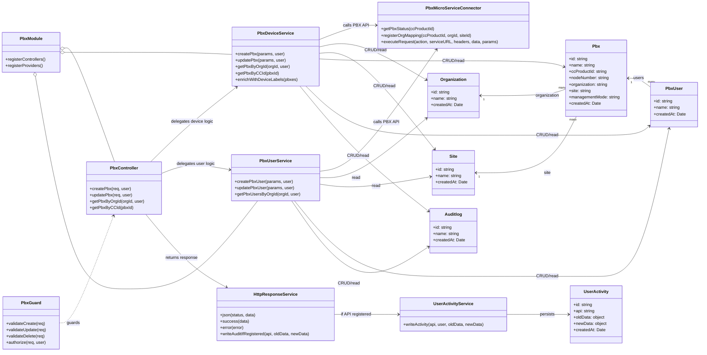
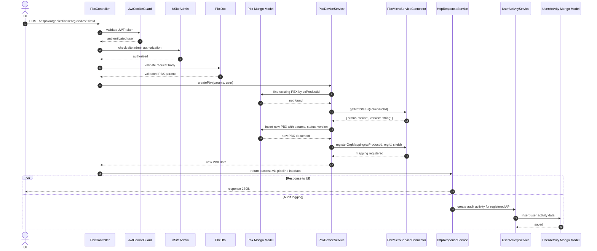

# PBX Management Workflow

Use this instruction for the target PBX architecture in NestBackend (backend v2). Treat it as the expected component workflow for new work, migrations, and reviews. Do not treat legacy Sails.js PBX code as the source of truth when it conflicts with this document.

## Class Diagram

## Create PBX Sequence Diagram

## Ownership And Entry Point
- All PBX APIs belong to NestBackend (backend v2).
- PBX endpoints must be declared inside `PbxModule` and handled by `PbxController`.
- `PbxController` methods are API mapping functions only, for example `createPbx`, `updatePbx`, `getPbxByOrgId`.
- Controllers must stay thin: accept request data, pass normalized parameters to services, and return the final HTTP response.

## Guard First
- Create, update, and delete requests must pass through guards before controller logic runs.
- Guards are responsible for validation and access checks.
- Do not duplicate guard validation inside the controller unless there is a strict business-rule fallback that cannot live in a guard.
- If a request is rejected by validation or authorization, fail before service execution.

## Service Responsibilities
- `PbxController` must delegate business logic to `PbxDeviceService` or `PbxUserService`.
- Typical service entry points include `createPbx(params, user)`, `getPbxByOrgId(orgId, user)`, `getPbxByCCId(pbxId)`, and `enrichWithDeviceLabels(pbxes)`.
- Services own orchestration, data composition, external PBX calls, Mongo CRUD, and any enrichment required before returning data.
- If the controller needs persisted PBX fields to build the response or satisfy audit mapping, the service must do that lookup and return the fields directly. For example, `updateMtclCredentials()` owns the `Pbx.findOne({ ccProductId })` lookup and returns `{ ccProductId, name }` in `response.data`.
- Controllers must not call Mongo models or PBX microservice connectors directly.

## External PBX Connector Boundary
- Services call `PbxMicroServiceConnector` for PBX-device-facing operations.
- Typical connector methods include `getPbxStatus(ccProductId)`, `registerOrgMapping(ccProductId, orgId, siteId)`, and `executeRequest(action, serviceURL, headers, data, params)`.
- Keep raw HTTP and transport concerns inside the connector.
- Normalize connector responses inside the service before returning data to the controller.

## Mongo Persistence Boundary
- Services may read or write Mongo models such as `Organization`, `Site`, `Pbx`, `PbxUser`, and `Auditlog`.
- Shared model expectations:
- Each Mongo model has a string `id`.
- Shared metadata includes `name` and `createdAt`.
- `Pbx` stores PBX-specific fields such as `ccProductId`, `nodeNumber`, `organization`, `site`, `managementMode`, and `createdAt`.
- Keep persistence logic in services or dedicated data-access helpers, not in controllers.

## Response Flow
- After processing PBX data from the connector or Mongo, the service returns normalized data to the controller.
- The controller returns responses through `HttpResponseService`.
- Keep response formatting consistent at the controller layer.
- Do not return raw connector payloads directly from controllers.

## Audit Logging
- `HttpResponseService` is the response boundary and must remain the integration point for audit-log-aware APIs.
- If the API is registered for audit logging, `HttpResponseService` must trigger `UserActivityService` to persist activity data in the `userActivity` Mongo model.
- When adding or modifying create, update, or delete PBX APIs, verify whether the route is registered for audit logging and pass the required old/new data for activity tracking.

## PBX Audit Collection Rules
- PBX audit logs are unified in the shared `useractivity` collection. `createExternalUserActivity()` writes to `UserActivity`, not `PbxAuditActivity`.
- PBX-originated records are identified with `createdBy: "PBX"`. Use that filter to separate PBX-source activity from standard BEFE activity.
- PBX audit readers must query a single collection and paginate natively with Mongo `skip` and `limit`; do not reintroduce application-side merge pagination, dual-collection reads, or `$unionWith` for this flow.
- Shared PBX audit constants such as `PBX_BEFE_ACTIONS` and `PBX_ALLOWED_FIELDS` live in `api/constants/pbxAudit.js` and must be imported by controllers and services instead of being re-declared locally.

## Required Flow
1. Request enters a `PbxController` method.
2. Guard layer validates and authorizes the request.
3. Controller forwards normalized input to `PbxDeviceService` or `PbxUserService`.
4. Service calls `PbxMicroServiceConnector` and-or Mongo models as needed.
5. Service returns processed data to the controller.
6. Controller returns the response via `HttpResponseService`.
7. `HttpResponseService` triggers audit logging when the API is registered for it.

## Do Not Do This
- Do not put PBX business logic in guards.
- Do not call `PbxMicroServiceConnector` directly from controllers.
- Do not access Mongo models directly from controllers.
- Do not bypass `HttpResponseService` for PBX API responses.
- Do not query `Pbx` from a controller just to decorate a service response or audit payload.
- Do not reintroduce `PbxAuditActivity`, dual-collection PBX audit merges, or `$unionWith` for PBX audit listing or export flows.
- Do not duplicate PBX audit action or allowed-field constants outside `api/constants/pbxAudit.js`.
- Do not leave async callbacks mis-indented inside `isDeploymentOption(OVTX)` or similar feature-gated branches when the scoping becomes ambiguous.
- Do not add a PBX endpoint outside `PbxModule` unless the architecture decision is explicitly changed.

