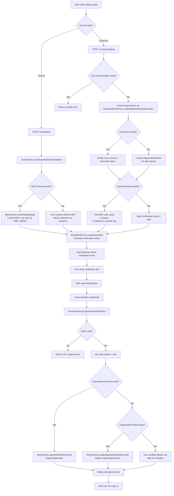
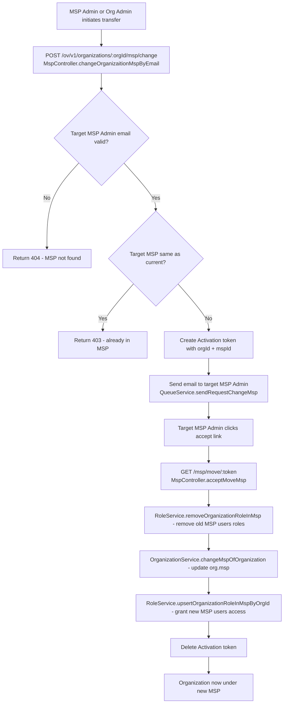

# User & Invitation System — Domain Knowledge

## Glossary

| Term | Meaning |
|------|---------|
| **MSP** (Managed Service Provider) | Partner entity — manages multiple Organizations. Also called "Partner". |
| **Organization** | Customer entity — contains Sites, managed by an MSP or standalone. |
| **Site** | Physical or logical location under an Organization (holds devices). |
| **Invitee** | Pending invitation record — becomes a User after signup + email verification. |
| **Activation** | Token record linking a user to an email verification or password-reset action. |
| **2FA** | Two-Factor Authentication — EMAIL code or GOOGLE_AUTHENTICATOR. |
| **Role Level** | Hierarchy: MSP > Organization > Site. A user belongs to ONE level only. |

---

## Entity Hierarchy

```
SuperAdmin / TechnicalSupport / PLM (special flags on User)
│
MSP (Partner)
├── MSP_ADMIN       → auto ORG_ADMIN on all orgs + SITE_ADMIN on all sites
├── MSP_VIEWER      → auto ORG_VIEWER on all orgs + SITE_VIEWER on all sites
├── MSP_LIMITED     → specific org/site permissions via `limitedOrganizations`
└── MSP_NONE        → revoked access (kept for audit)
    │
    Organization (Customer)
    ├── ORGANIZATION_ADMIN   → auto SITE_ADMIN on all sites
    ├── ORGANIZATION_VIEWER  → auto SITE_VIEWER on all sites
    ├── ORGANIZATION_LIMITED → specific site permissions via `limitedSites`
    └── ORGANIZATION_NONE    → revoked access
        │
        Site
        ├── SITE_ADMIN
        ├── SITE_VIEWER
        └── SITE_NONE
```

---

## User Creation Workflow (Signup)



---

## Invitation Workflow

```mermaid
flowchart TD
    subgraph MSP_Invitation [MSP User Invitation]
        MA[MSP Admin opens Invite page] --> MB[POST /ov/v1/msps/:mspId/invitees]
        MB --> MC[InviteeController.inviteUsersInMsp]
        MC --> MC1{User already exists with email?}
        MC1 -->|Yes & already in MSP| MC2[Skip - add to refusedEmails]
        MC1 -->|Yes & not in MSP| MC3[Add user directly via<br/>RoleService.upsertMSPRoleForUser]
        MC1 -->|No| MC4{Pending join request exists?}
        MC4 -->|Yes| MC5[Accept request + assign role]
        MC4 -->|No| MC6[RoleService.createMspInvitee]
        MC3 --> MD[QueueService.sendNewUsersInvitationsQueue]
        MC5 --> MD
        MC6 --> MD
        MD --> ME[Email sent to invitee]
        ME --> MF{Invitee already has account?}
        MF -->|Yes| MG[POST /ov/v1/msps/:mspId/invitees/:id/accept<br/>acceptInviteeInMsp]
        MF -->|No| MH[Invitee signs up → verifyEmail<br/>auto-assigns role from MspInvitee]
    end

    subgraph ORG_Invitation [Organization User Invitation]
        OA[Org Admin opens Invite page] --> OB[POST /ov/v1/organizations/:orgId/invitees]
        OB --> OC[InviteeController.inviteUsersInOrganization]
        OC --> OC1{User already in this org?}
        OC1 -->|Yes| OC2[Skip - add to refusedEmails]
        OC1 -->|No| OC3[RoleService.createOrganizationInvitee]
        OC3 --> OD[QueueService.sendNewUsersInvitationsQueue]
        OD --> OE[Email sent to invitee]
        OE --> OF{Invitee already has account?}
        OF -->|Yes| OG[POST /ov/v1/organizations/:orgId/invitees/:id/accept<br/>acceptInviteeInOrganization]
        OF -->|No| OH[Invitee signs up → verifyEmail<br/>auto-assigns role from OrganizationInvitee]
    end

    subgraph JOIN_Request [Partner Join Request]
        JA[Partner signs up with<br/>existing MSP name] --> JB[InvitationService.createMspInvitationRequest]
        JB --> JC[InvitationRequest record created]
        JC --> JD[MSP Admin sees pending requests]
        JD --> JE{Admin decision}
        JE -->|Accept| JF[InviteeController.acceptInvitationRequest<br/>→ upsertMSPRoleForUser]
        JE -->|Reject| JG[InviteeController.rejectInvitationRequest<br/>→ deleteInvitationRequestByIds]
    end
```



---

## Role Cascading Rules

When a role is assigned at a higher level, it **automatically cascades** to lower levels:

| Action | Cascade Effect |
|--------|---------------|
| Assign **MSP_ADMIN** | → Creates **ORG_ADMIN** for ALL orgs in MSP → Creates **SITE_ADMIN** for ALL sites |
| Assign **MSP_VIEWER** | → Creates **ORG_VIEWER** for ALL orgs → Creates **SITE_VIEWER** for ALL sites |
| Assign **MSP_LIMITED** | → Creates specific ORG roles from `permissions[]` → Cascades site roles per org role |
| Assign **ORG_ADMIN** | → Creates **SITE_ADMIN** for ALL sites in org |
| Assign **ORG_VIEWER** | → Creates **SITE_VIEWER** for ALL sites in org |
| Assign **ORG_LIMITED** | → Creates specific SITE roles from `permissions[]` |
| New Org created in MSP | → All MSP_ADMIN get ORG_ADMIN, MSP_VIEWER get ORG_VIEWER |
| New Site created in Org | → All ORG_ADMIN get SITE_ADMIN, ORG_VIEWER get SITE_VIEWER |

**Important**: When updating a role, the pattern is:
1. Remove existing lower-level roles (`removeAllOrganizationRoleForUser`, `removeAllSiteRoleForUser`)
2. Re-assign with new role (which triggers cascading)

---

## User Permission Features (Actions Available by Role)

### MSP Level (Partner)

| Feature | MSP_ADMIN | MSP_VIEWER | MSP_LIMITED |
|---------|-----------|------------|-------------|
| View MSP users | ✅ | ✅ | ❌ |
| Invite users to MSP | ✅ | ❌ | ❌ |
| Update MSP user roles | ✅ | ❌ | ❌ |
| Revoke MSP user access | ✅ | ❌ | ❌ |
| Create Organization | ✅ | ❌ | ❌ |
| View all Organizations | ✅ | ✅ | Limited |
| Update Organization | ✅ | ❌ | Per-org |
| Delete Organization | ✅ | ❌ | ❌ |
| View Org users | ✅ | ✅ | Per-org |
| Invite Org users | ✅ | ❌ | Per-org (if ORG_ADMIN) |
| Update MSP settings | ✅ | ❌ | ❌ |
| Enforce 2FA on MSP | ✅ | ❌ | ❌ |
| Force logout sessions | ✅ | ❌ | ❌ |
| Accept/reject join requests | ✅ | ❌ | ❌ |

### Organization Level (Customer)

| Feature | ORG_ADMIN | ORG_VIEWER | ORG_LIMITED |
|---------|-----------|------------|-------------|
| View Org users | ✅ | ✅ | ❌ |
| Invite users to Org | ✅ | ❌ | ❌ |
| Update Org user roles | ✅ | ❌ | ❌ |
| Revoke Org user access | ✅ | ❌ | ❌ |
| Create Site | ✅ | ❌ | ❌ |
| View all Sites | ✅ | ✅ | Limited |
| Update Site | ✅ | ❌ | Per-site |
| Delete Site | ✅ | ❌ | ❌ |
| Update Org settings | ✅ | ❌ | ❌ |
| Enforce 2FA on Org | ✅ | ❌ | ❌ |
| Manage devices | ✅ | ❌ | Per-site |
| Force logout sessions | ✅ | ❌ | ❌ |

### Site Level

| Feature | SITE_ADMIN | SITE_VIEWER |
|---------|-----------|------------|
| View devices | ✅ | ✅ |
| Manage devices | ✅ | ❌ |
| View alerts | ✅ | ✅ |
| Configure site | ✅ | ❌ |

---

## RoleService Function Reference

### MSP Role Management

| Function | Purpose | Side Effects |
|----------|---------|--------------|
| `upsertMSPRoleForUser(userId, mspId, params, permissions)` | Create or update MSP role | Cascades to Org + Site roles |
| `createMSPNoneRoleForMultipleUsers(ids, mspId)` | Revoke MSP access for multiple users | Destroys existing MspUser, creates MSP_NONE |
| `removeMspRoleForUser(userId, mspId)` | Destroy MspUser record | Must call removeOrg/Site first |
| `removeOrgUserRoleSiteUserRoleFromMSPRoleForUser(userId, mspId, cachedOrgs, cachedSiteIds)` | Remove all cascaded Org + Site roles | Used during verifyEmail role reassignment |
| `getMspRoleOfUser(userId)` | Get user's MSP role | Returns single MspUser |
| `getAllMspRole()` | Get all MspUser records | For super admin / tech support |
| `getMspOfUser(userId)` | Get the MSP ID attached to user | Checks MspUser → OrganizationUser → Site chain |
| `moveAllUserToNewMsp(sourceMspId, destMspId)` | Move all users between MSPs | Updates MspUser.msp |
| `moveAllInviteeToNewMsp(sourceMspId, destMspId)` | Move all invitees between MSPs | Updates MspInvitee.msp |

### Organization Role Management

| Function | Purpose | Side Effects |
|----------|---------|--------------|
| `assignAdminForOrganization(orgId, mspId, userId)` | Auto-assign admin when org created | MSP_ADMIN→ORG_ADMIN, MSP_VIEWER→ORG_VIEWER |
| `createOrganizationRoleForUser(userId, orgId, params, permissions)` | Create Org role | Cascades to Site roles |
| `removeAllOrganizationRoleForUser(userId, mspId)` | Remove all Org roles for user | Filters by MSP's orgs |
| `removeAllOrganizationRoleForMultipleUser(ids)` | Batch remove Org roles | |
| `removeOrganizationRoleForUser(userId, orgId)` | Remove single Org role | Must remove Site roles first |
| `removeOrganizationRoleInMsp(orgId)` | Remove all users' Org roles when org detached | |
| `upsertOrganizationRoleInMspByOrgId(mspId, orgId)` | Re-sync MSP users' Org roles | Called when org added to MSP |
| `resetOrganizationRoleInMsp(mspId)` | Full re-sync of all org roles | Heavy operation |
| `removeAllOrgSiteRoleForMspUsers(mspId, orgId)` | Remove org+site roles for MSP users | Used when org removed from MSP |
| `getOrganizationRoleOfUser(userId)` | Get all Org roles for user | Returns array |
| `getOrganizationRoleOfUserIdAndOrgId(userId, orgId)` | Get specific Org role | |
| `getAllOrganizationRole()` | All OrganizationUser records | For super admin |

### Site Role Management

| Function | Purpose | Side Effects |
|----------|---------|--------------|
| `createSiteRoleForUser(userId, siteId, params)` | Create SiteUser record | |
| `removeAllSiteRoleForUser(userId, siteIds)` | Remove site roles by site IDs | |
| `removeAllSiteRoleForMultipleUser(ids)` | Batch remove all site roles | |
| `removeAllOrganizationSiteRoleForUser(userId, orgId)` | Remove site roles for sites in org | |
| `getSiteRoleOfUser(userId)` | Get all site roles for user | Deduplicates |
| `getSiteRoleOfUserBySiteId(userId, siteId)` | Get specific site role | |

### Invitee Management

| Function | Purpose | Model |
|----------|---------|-------|
| `createMspInvitee(params)` | Create MSP invitation | MspInvitee |
| `createOrganizationInvitee(params)` | Create Org invitation | OrganizationInvitee |
| `updateMspInviteeById(id, params)` | Update MSP invitee role/message | MspInvitee |
| `updateOrganizationInviteeById(id, params)` | Update Org invitee role/permissions | OrganizationInvitee |
| `getMspInviteeById(id)` | Get MSP invitee | MspInvitee |
| `getOrganizationInviteeById(id)` | Get Org invitee | OrganizationInvitee |
| `getMspInviteeByEmail(email)` | Find MSP invitee by email | MspInvitee |
| `getOrganizationInviteesByEmail(email, options)` | Find Org invitees by email | OrganizationInvitee |
| `getMspInviteeByMsp(mspId)` | List all MSP invitees | MspInvitee |
| `getOrganizationInviteeByOrgId(orgId)` | List all Org invitees | OrganizationInvitee |
| `deleteMspInviteeById(id)` | Delete MSP invitee | MspInvitee |
| `deleteOrganizationInviteeById(id)` | Delete Org invitee | OrganizationInvitee |
| `deleteMultipleInviteeInMsp(ids)` | Batch delete MSP invitees | MspInvitee |
| `deleteMultipleInviteeInOrganization(ids)` | Batch delete Org invitees | OrganizationInvitee |
| `deleteOrganizationInviteesByEmail(email)` | Delete all Org invitees for email | OrganizationInvitee |
| `deleteInviteesByEmailOfOrganization(email, orgId)` | Delete invitees of specific org | OrganizationInvitee |

### Role Level Detection

| Function | Purpose | Returns |
|----------|---------|---------|
| `getRoleLevelPermission(userId)` | Detect user's highest role level | `{ accessLevelRole, msp? / allOrgRoles? }` |
| `getEntityRoleLevel(userId)` | Get role level with entity data | `{ level: "MSP"/"ORG"/"ORGs", role: {...} }` |

---

## Data Models

### User
- `email` (unique, required) — login identifier
- `verified` (boolean) — account activated via email
- `isSuperAdmin`, `isTechnicalSupportUser`, `isPLM` — special privileges (bypass RBAC)
- `isTwoFAEnabled`, `faMethod` — 2FA settings (EMAIL / GOOGLE_AUTHENTICATOR)
- `tempSecret`, `secret` — Google Authenticator secrets
- `ssoId`, `authServerId` — SSO/LDAP federation (non-local users)
- `revokedAllSessionsAt` — invalidates all JWTs issued before this date

### MspUser (join table: User ↔ MSP)
- `user` → User model
- `msp` → Msp model
- `role` — MSP_ADMIN | MSP_VIEWER | MSP_LIMITED | MSP_NONE

### OrganizationUser (join table: User ↔ Organization)
- `user` → User model
- `organization` → Organization model
- `role` — ORGANIZATION_ADMIN | ORGANIZATION_VIEWER | ORGANIZATION_LIMITED | ORGANIZATION_NONE
- Lifecycle: clears `userOrgRoleCache` on create/update/destroy

### SiteUser (join table: User ↔ Site)
- `user` → User model
- `site` → Site model
- `role` — SITE_ADMIN | SITE_VIEWER | SITE_NONE

### MspInvitee (pending MSP invitation)
- `email`, `firstname`, `lastname`, `message`
- `role` — target MSP role (isIn: userRoles.msp)
- `limitedOrganizations` (json) — for MSP_LIMITED: `{ permissions: [{ orgId, role }] }`
- `msp` → Msp model
- `invitedBy` → User model
- beforeCreate: validates email uniqueness per MSP

### OrganizationInvitee (pending Org invitation)
- `email`, `firstname`, `lastname`, `message`
- `role` — target Org role (isIn: userRoles.organization)
- `limitedSites` (json) — for ORG_LIMITED: site permissions
- `typeInvitor` — "USER" or "SYSTEM"
- `organization` → Organization model
- `invitedBy` → User model
- beforeCreate: validates email uniqueness per Organization

### Activation (email verification / password reset token)
- `token` — random string
- `body` (json) — optional payload
- `user` → User model

---

## Key Business Rules

1. **One MSP per user**: A user can belong to only ONE MSP (MspUser is unique per user).
2. **Multiple Orgs**: A user can have access to multiple Organizations (multiple OrganizationUser records).
3. **Invitee → User**: When a user verifies email, matching MspInvitee/OrganizationInvitee records are consumed (role applied, invitee deleted).
4. **MSP_LIMITED permissions format**: `{ permissions: [{ orgId: "abc", role: "ORGANIZATION_ADMIN" }] }` — only org-level role mapping (ADMIN/VIEWER/NONE per org). No site-level overrides; limited MSP users get full access within each granted org based on the org role.
5. **ORG_LIMITED permissions format**: `{ userSitePermissions: [{ siteId: "xyz", role: "SITE_ADMIN" }] }`
6. **Partner signup options**: Partner can create an MSP (becomes MSP_ADMIN) OR create an account with no MSP/org access (will be attached via invitation later). A customer is not supposed to create an MSP, but the partner signup form is accessible — if a customer creates one by mistake, the real partner must contact the client to fix the entity structure via Move MSP flow.
7. **Device access = Site access**: There are no device-level permissions. A device is always attached to a site. Site role controls device access.
8. **2FA enforcement**: MSP or Organization admin can set `is2FARequired = true`, forcing all users in that entity to configure 2FA.
9. **Password policy**: `EnforcePasswordSettingService` validates password strength at signup and reset; policy comes from `PolicySetting` model.
10. **SSO users**: Users with `ssoId` or `authServerId` are not local — they bypass password policy and 2FA local setup.

---

## Frontend Pages Reference

| Page | Location | Purpose |
|------|----------|---------|
| Signup wizard | `frontend/src/components/auth/signup.vue` | 3-step signup (Partner or Customer) |
| Signin | `frontend/src/components/auth/signin.vue` | Login + SSO + 2FA |
| Email verification | `frontend/src/components/auth/emailverification.vue` | 2FA code entry |
| Password reset | `frontend/src/components/auth/newPassword.vue` | Set new password |
| MSP Users list | `frontend/src/components/mspuser/mspUsers.vue` | Manage MSP users & 2FA |
| Edit MSP user | `frontend/src/components/mspuser/editMspUser.vue` | Change MSP user role |
| Invite MSP user | `frontend/src/components/mspuser/newOrEditMspInvitation.vue` | Create/edit MSP invitation |
| Org Users list | `frontend/src/components/organizationuser/organizationUsers.vue` | Manage Org users & 2FA |
| Edit Org user | `frontend/src/components/organizationuser/editOrganizationUser.vue` | Change Org user role |
| Invite Org user | `frontend/src/components/organizationuser/newOrEditOrganizationInvitation.vue` | Create/edit Org invitation |

### Store Modules (API layer)

| Module | File | Covers |
|--------|------|--------|
| auth | `store/modules/auth.js` | signup, signin, 2FA, token refresh, profile |
| mspuser | `store/modules/mspuser.js` | MSP user CRUD, invitations, sessions |
| organizationuser | `store/modules/organizationuser.js` | Org user CRUD, invitations, sessions |
| permission | `store/modules/permission.js` | Role getters and level detection |
| msp | `store/modules/msp.js` | MSP entity management |
| organization | `store/modules/organization.js` | Organization entity management |

---

## API Routes Summary

### Public (no auth)
| Method | Route | Action |
|--------|-------|--------|
| POST | `/user/signup` | Partner signup |
| POST | `/customer/signup` | Customer signup |
| POST | `/user/signin` | Signin |
| GET | `/user/verify/:token` | Email verification |
| POST | `/user/reset` | Password reset request |
| POST | `/user/password/reset/:token` | Set new password |

### Authenticated
| Method | Route | Action |
|--------|-------|--------|
| GET | `/user/profile` | Get profile |
| PUT | `/user/profile` | Update profile |
| POST | `/ov/v1/msps/:mspId/invitees` | Invite to MSP |
| POST | `/ov/v1/organizations/:orgId/invitees` | Invite to Org |
| POST | `/ov/v1/msps/:mspId/users/:userId/roles` | Update MSP role |
| POST | `/ov/v1/organizations/:orgId/users/:userId/roles` | Update Org role |
| DELETE | `/ov/v1/msps/:mspId/users/:userId/roles` | Remove from MSP |
| DELETE | `/ov/v1/organizations/:orgId/users/:userId/roles` | Remove from Org |

---

## Move MSP Workflow (Organization Transfer)

When an organization needs to move from one MSP to another (e.g., customer was mistakenly attached, or partner change):



---

## Common Support Questions (FAQ)

| Question | Answer | Root Cause |
|----------|--------|------------|
| "Email already invited" when inviting to MSP | The email already has a MspInvitee record for this MSP | `MspInvitee.beforeCreate` prevents duplicate email per MSP. Delete old invitation first or resend it. |
| "Email already invited" when inviting to Org | The email already has an OrganizationInvitee record for this org | `OrganizationInvitee.beforeCreate` prevents duplicate email per Organization. |
| "User is already in MSP" (refusedEmails) | User with that email already has a MspUser record | A user can only belong to ONE MSP. Must remove from current MSP first via Move MSP or delete role. |
| "User already in this organization" | User has an OrganizationUser record for this org | User already has access — update their role instead of re-inviting. |
| User signed up but has no access | User verified email but no MspInvitee/OrganizationInvitee existed | User needs to be invited, or admin must manually assign a role. |
| Partner created MSP by mistake (customer) | Customer used the Partner signup form | Use Move MSP flow: real partner's MSP Admin accepts the org transfer. Or support can use `moveAllUserToNewMsp`. |
| Invitation not consumed after signup | User created account but invitee email doesn't match exactly | Email comparison is case-insensitive in `beforeCreate`, but verify the flow in `UserController.verifyEmail`. |
| User lost 2FA access | User can't access Google Authenticator device | Use `sendEmailResetTwoFA` → admin receives link → `disableTFAForUser` resets 2FA. |

---

## Common Pitfalls

1. **Forgetting cascade**: When changing a role, always remove lower-level roles first, then re-assign.
2. **MSP_LIMITED without permissions**: If `permissions[]` is empty, no Org/Site roles are created.
3. **Duplicate OrganizationUser**: `beforeCreate` on models prevents duplicate email per entity, but code must still check.
4. **Invitee not deleted**: After `verifyEmail` consumes an invitee, the invitee record MUST be deleted.
5. **Cache invalidation**: `OrganizationUser` lifecycle hooks clear `userOrgRoleCache` — don't bypass Waterline for org role changes.
6. **One MSP constraint**: A user can only belong to ONE MSP. Attempting to invite a user who already has a MspUser record to a different MSP will be refused — must remove from current MSP first.
7. **Move MSP requires MSP_ADMIN email**: The target MSP must have an admin, and the transfer email is sent to that admin for acceptance.
